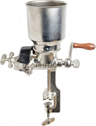

# Apparatuur {#apparatuur}

**Doelstellingen**

-  Weten welke apparatuur nodig is om te kunnen brouwen.
-  Hoe je aan deze apparatuur kunt komen (zelf maken / kopen)
-  Het gebruik van een hygrometer
-  het gebruik van een refractometer

## Minimale benodigdheden

Welke apparatuur je nodig hebt hangt af van de gevolgde brouwmethode, het brouwvolume en het budget. Over de verschillende brouwmethodes wordt later behandeld, zie \@ref(brouwmethodes). veel hobbybrouwers zijn ook handige doe het zelvers en maken een groot deel van de spullen zelf. Het Twents Bierbrouwersgilde heeft voor haar leden ook leenapparatuur beschikbaar. Zeker in het begin is het beter om niet gelijk van alles aan te schaffen. orienteer je eerst goed, overleg met je mentor en vraag op een gildeavond om advies en hulp.

In dit deel van de cursus worden een aantal spullen genoemd die je minimaal nodig hebt.

**Weegschaal**

Voor het afwegen van de mout en hop volstaat een goede keukenweegschaal met een nauwkeurigheid van 1 gram.

**Litermaat**

Voor het afmeten van de hoeveelheid maisch- en spoelwater heb je een litermaat nodig, minimaal met een nauwkeurigheid van 100 ml.

**Schrootmolen**

Deze heb je nodig voor het schroten van de mout. De goedkoopste uitvoering is een **schijvenmolen** en een wat duurdere variant is de **walsenmolen**. Vaak kun je deze ook wel bij een lid van het gilde lenen.

**Maischpan / Kookpan**

**Roerspaan**

**Gasbrander / Kookplaat**

**Thermometer**

**Kookwekker**

**Filter**

**Gistvat**

**Waterslot**

**Hevel**

**Borstels**

Vooral een flessenborstel voor het schoonmaken van gebruikte bierflessen.

**Koeler**

**Kroonkurkapparaat**

Wanneer je in beugelflessen bottelt heb je deze niet nodig.

**Hydrometer met maatcilinder**

Een refractometer kan ook.

**Bierflessen**

Wanneer je geen beugelflessen gebruikt heb je ook kroonkurken nodig.

**pH papier of pH meter**

**Melkzuur / Fosforzuur**

**Schoonmaak- en Ontsmettingsmiddelen**

**Jodiumtinctuur**

## Optionele benodigdheden

Aanvullende handige hulpmiddelen

**Vergistingskast**
