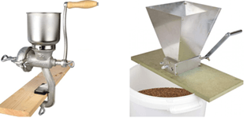
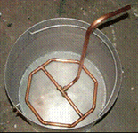

# Apparatuur {#apparatuur}

```{block2, type="chapterintro"}
**Doelstellingen**

-  Je weet welke apparatuur nodig is om te kunnen brouwen.
-  Je weet hoe je aan deze apparatuur kunt komen (zelf maken / kopen).
-  Je kunt een hydrometer op de juiste manier gebruiken.
-  Je kunt een refractometer op de juiste manier gebruiken.

```

## Minimale benodigdheden

Welke apparatuur je nodig hebt hangt af van de gevolgde brouwmethode, het brouwvolume en het budget. De verschillende brouwmethodes worden later behandeld, zie hoofdstuk \@ref(brouwmethodes). Bij de automatische brouwketels zoals die van de merken Braumeister, Brew Monk en Grainfather heb je maar een paar dingen extra nodig. En bij de niet geautomatiseerde electrische ketels, waaronder een weckketel, heb je geen verwarming nodig. Bij het brouwen in pannen op gas heb je nagenoeg al het onderstaande nodig.

Veel hobbybrouwers zijn ook handige doe-het-zelvers en maken een groot deel van de spullen zelf. Veel bierbrouwgildes hebben voor de leden ook leenapparatuur beschikbaar. Zeker in het begin is het beter om niet gelijk van alles aan te schaffen. Orienteer je eerst goed, overleg met ervaren brouwers en vraag op een gildeavond om advies en hulp.

### Schrootmolen

Deze heb je nodig voor het schroten van de mout. De goedkoopste uitvoering is een **schijvenmolen** en een wat duurdere variant is de **walsenmolen**. Een schijvenmolen vermaalt de mout wat meer. Een walsenmolen kneust de mout. Vaak kun je een schrootmolen wel bij een lid van het gilde lenen. De meeste molens kun je ook met een boormachine laten draaien.

```{r schrootmolens, echo=FALSE, fig.cap="Twee soorten schrootmolens. Links een schijvenmolen en rechts een walsenmolen.", out.width="50%"}

```

### Maischpan / Kookpan

Je kunt een installatie zo uitgebreid maken als je wilt. Van 1 of 2 brouwpannen tot meerdere. Met of zonder kraan, met of zonder electrische verwarming, met of zonder volume-aanduiding, ... De grootte (het volume) hangt af van de hoeveelheid bier die je wilt brouwen. Een vuistregel is dat de pannen zo'n anderhalf tot twee keer groter moeten zijn als het te brouwen volume bier.

```{r brouwketel-kraan, echo=FALSE, fig.cap="Brouwketel met kraan.", out.width="30%"}
knitr::include_graphics("images/brouwketel-kraan.png")
```

### Gasbrander / Kookplaat

Het verwarmingsmiddel moet wel bij de pannen passen en voldoende vermogen hebben. De opwarmsnelheid van de wort moet zo'n 0,5- 1^o^C per minuut zijn. Voor kleine ketels (tot 10 liter) kun je vaak de keuken gebruiken of een losse electrische kookplaat. Voor de wat grotere ketels zit je vaak wel aan gas vast.

```{r gasbrander, echo=FALSE, fig.cap="Gasbrander", out.width="30%"}

```

### Koeler

Om de hete wort snel af te koelen heb je een koeler nodig. Je hebt de volgende types:

-  *Dompelkoeler*, spiraalvormig. Deze dompel je dus in de hete vloeistof en je laat koud water door de spiraal lopen. Dit type is gemakkelijk schoon te maken en te desinfecteren. Veel hobbybrouwers maken er zelf eentje met buis van RVS of koper.
-  *Tegenstroomkoeler*, meestal een platenkoeler. Deze plaats je buiten de pan waarbij de wort en het koelwater in tegenovergestelde richting stromen. Deze koelt het beste, maar het reinigen en desinfecteren hiervan vergt wat meer aandacht.

```{r wortkoeler, echo=FALSE, fig.cap="Links een dompelkoeler, rechts een platenkoeler.", out.width="50%"}

```

### Wortfilter

Een wortfilter dient er voor om de vloeistof (wort) van de vaste stoffen (moutresten, kafjes) te scheiden. Het is niet moeilijk om er zelf een te maken die past bij de maischpan, zie figuur \@ref(fig:wortfilter).

```{r wortfilter, echo=FALSE, fig.cap="Wortfilter van koper met hevel.", out.width="30%"}

```

Er zijn ook andere oplossingen zoals

-  Maischpan met "valse bodem" waarbij een schijf met kleine gaatjes een eindje boven de echte bodem bevestigd is, strak tegen de wand. Hierop ligt dan de mout. De wort kun je dan onder deze valse bodem aftappen.
-  Filteremmer, een emmer met gaatjes in de bodem of een rooster.

### Gistvat

Er zijn allerlei soorten vaten te koop waarin je de vergisting kunt laten plaatsvinden. Ze verschillen in materiaal (glas, kunststof, RVS), in vorm (rond, konisch ondereind), al dan niet met aftapkranen voor het bier en/of gistdroesem. En natuurlijk verschillen ze in prijs.

```{r gistvat, echo=FALSE, fig.cap="Gistvat van kunststof met aftapkraan.", out.width="25%"}
knitr::include_graphics("images/gistvat.png")
```

### Waterslot

Een gistvat moet van de buitenlucht worden afgesloten. Meestal wordt daarvoor een waterslot genomen. In figuur \@ref(fig:waterslot) zie je twee modellen. Links het klassieke slangmodel, rechts het cylindrische model. In beide gevallen wordt het waterslot gevuld met water waardoor het vat van de buitenlucht wordt afgesloten. Het koolzuurgas dat tijdens de vergisting in het vat ontstaat kan door de overdruk door het water borrelen, naar buiten toe. Het cylindrische model is beter schoon te maken en is ook beter geschikt bij een heftige vergisting.

```{r waterslot, echo=FALSE, fig.cap="Waterslot, links een slangmodel, rechts een cylindrische model.", out.width="25%"}

```

### Hydrometer met maatcilinder

Een hydrometer is een instrument om de dichtheid (soortelijke massa) van vloeistoffen te bepalen. Het instrument ziet eruit als een glazen dobber die aan de onderkant is gevuld met loodkorrels of kwik. Hoe dieper de hydrometer in de vloeistof zinkt des te lager is de dichtheid.

```{block2, type="tip"}
De dichtheid of soortelijke massa van een stof is de massa (kg) gedeeld door het volume (m^3^). De dichtheid is afhankelijk van de temperatuur en druk en daarom moeten deze erbij vermeld worden. Bij 4^o^C en 1 atmosfeer druk is de dichtheid van water 999,972 kg/m^3^. Gemakshalve wordt voor de dichtheid van water meestal uitgegaan van 1000 kg/m^3^ = 1 kg/lit = 1000 gr/lit = 1 gr/ml.

De relatieve dichtheid (Specific Gravity, SG) van een vloeistof is de dichtheid van de vloeistof gedeeld door de dichtheid van water, alles gemeten bij 4^o^C en 1 atmosfeer druk. Deze eenheid is dimensieloos. De relatieve dichtheid van water is 1,000.
```

Om een hydrometer te gebruiken doe je in een maatcilinder voldoende vloeistof en laat je hierin de hydrometer zakken. Deze moet vrij van de bodem en de wand kunnen zweven. Draai de hydrometer een paar keer rond zodat klevende gasbelletjes kunnen ontsnappen. Laat de hydrometer tot rust komen en lees af op het vloeistofniveau, zie figuur \@ref(fig:hydrometer-aflezing).

Een hydrometer is geijkt op 20^o^C, meet daarom ook de temperatuur van de vloeistof en breng indien nodig een temperatuurcorrectie aan. Bij de goede hydrometers is meestal een tabel bijgesloten voor de temperatuurcorrectie. Zoniet, dan kun je de volgende vuistregel hanteren: per 5^o^C hoger/lager dan 20, het SG met 0,001 verhogen/verlagen.

```{r hydrometer-aflezing, echo=FALSE, fig.cap="Hydrometer met bijpassende maatcilinder.", out.width="50%"}

```

```{block2, type="tip"}
In plaats van een hydrometer kun je ook een refractometer gebruiken.

```

### Kroonkurken en kroonkurkapparaat

Wanneer je in beugelflessen bottelt heb je deze niet nodig.

```{r kroonkurkapparaat, echo=FALSE, fig.cap="Kroonkurkapparaat.", out.width="25%"}
knitr::include_graphics("images/kroonkurkapparaat.png")
```

### Diverse accessoires

-  Weegschaal, voor het afwegen van de mout en hop volstaat een goede keukenweegschaal met een nauwkeurigheid van 1 gram. Let ook op het maximaal toelaatbaar gewicht, vaak is dit 5 kg.
-  Litermaat, voor het afmeten van de hoeveelheid maisch- en spoelwater heb je een litermaat nodig, minimaal met een nauwkeurigheid van 100 ml.
-  Thermometer
-  Kookwekker
-  Borstels (vooral flessenborstel)
-  Schoonmaakpads
-  Hevel
-  Vulpijpje, voor het handig afvullen van bierflessen
-  Hopzakjes
-  Roerlepel/roerspaan (lang)
-  Jodiumtinctuur (voor de jodiumtest)
-  pH papier voor de bereiken 3,8-5,5 en 5,2-6,8 (een duurdere pH meter kan natuurlijk ook)
-  Schoonmaakmiddelen, zie hoofdstuk \@ref(hygiene)
-  Melkzuur of Fosforzuur, voor het aanzuren van maisch en spoelwater. Meestal heb je maar een paar ml nodig. Het afmeten kan met een kleine maatcilinder, een injectiespuit of een pipet.
-  Bierflessen (goed schoongemaakt!)

## Handige hulpmiddelen

### Refractometer

Een refractometer meet de brekingsindex van licht door een vloeistof (bijvoorbeeld wort, bier, wijn). Aan de hand hiervan kan dan de hoeveelheid opgeloste suiker in een waterige vloeistof worden bepaald. Hoe meer opgeloste suiker, hoe meer het licht gebroken wordt. Een refractometer kan daarom gebruikt worden om de dichtheid (soortelijke massa) van een vloeistof te bepalen.

```{r refractometer, echo=FALSE, fig.cap="Refractometer en de aflezing daarvan.", out.width="40%"}

```

Maak het glazen prisma schoon en droog, breng dan 1-2 druppels vloeistof aan, druk het afsluitkapje aan en houdt de refractometer tegen het licht. In het kijkglas zie je dan een horizontale kleurgrens. Stel eventueel scherp en lees de meetwaarde op de schaal af.

De meeste refractometers gebruiken als meeteenheid het aantal graden *Brix*. En 1^o^ Brix is 1 gram sucrose in 100 gram oplossing. En Brix kun je vrij gemakkelijk omrekenen naar SG, zie hoofdstuk \@ref(rekenen).

**Calibreren**

Voor het calibreren van een refractometer is het zetten van het nulpunt meestal voldoende. Dit doe je door een meting met gedestilleerd (of gedemineraliseerd) water uit te voeren. Gedestilleerd water heeft namelijk een dichtheid van 1,000 en de Brixwaarde moet dan dus 0 zijn. Een goede refractometer heeft een stelknop of stelschroef om de schaalaflezing op 0 in te stellen. 

Voor een nog grotere nauwkeurigheid kun je eventueel nog een ijking voor een punt aan het eind van de schaal uitvoeren. Echter deze ijking kun je niet op de refractometer zelf instellen, maar vaak wel in de brouwsoftware invoeren. Voor deze ijking moet je een suikeroplossing maken met een bekende Brixwaarde, bijvoorbeeld 20 gram suiker en 80 gram water. Deze heeft een Brix van 20.

```{block2, type="tip"}
Je kunt natuurlijk ook metingen uitvoeren met zowel de refractometer en een hydrometer en deze waarden met elkaar vergelijken.

```

### Vergistingskast

Een gecontroleerde en juiste vergistingstemperatuur verhoogt de kwaliteit van het vergistingsproces en dus van je bier. Om dat te bereiken heb je een zogenaamde vergistingskast nodig. Veel hobbybrouwers maken deze zelf door in een oude koelkast een verwarmingselement aan te brengen. Verder heb je dan nog een thermostaat nodig die via een sensor de temperatuur meet en dan zowel de verwarming als de koeling kan aansturen. De goedkoopste oplossing voor de doe-het-zelver is de STC-1000 die je voor een tientje al kunt kopen. Je moet dan nog wel zelf het een en ander in elkaar knutselen. Een kant-en-klare oplossing is de Inkbird ITC voor ca. 50 euro. Heb je in huis een ruimte waar de temperatuur constant 18-20 graden is dan kun je die ruimte ook gebruiken.

```{r inkbird, echo=FALSE, fig.cap="Inkbird ITC-308 temperatuurregelaar.", out.width="30%"}

```
