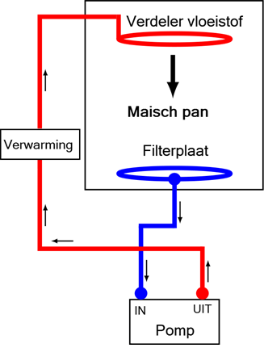

# Brouwmethodes {#brouwmethodes}

:::{.chapterintro}
**Doelstellingen**

-  Je leert een aantal brouwmethodes kennen.
-  Je maakt kennis met een paar verschillende brouwinstallaties.
:::

## Methodes

### Stijgende infusie

Dit is de methode die het meest wordt toegepast. Hierbij wordt het maischwater verwarmd tot de inmaischtemperatuur. Daarna wordt het maischschema gevolgd, waarbij het beslag na de rusttijd tot de volgende temperatuur wordt opgewarmd.

### Dalende infusie

Dit is een van oorsprong Engelse methode, waarbij tijdens het maischen maar één temperatuur, $\pm 65^oC$ wordt aangehouden. Hierbij wordt het maischwater verwarmd tot iets boven de inmaischtemperatuur. Daarna wordt de mout gestort waardoor de temperatuur daalt tot de maischtemperatuur, welke vervolgens een tijdlang (ca. anderhalf uur) wordt aangehouden. Brouwsoftware kan voor je uitrekenen tot welke temperatuur je het maischwater moet verwarmen voordat je de mout stort.

### Decoctie

Hierbij wordt een deel van het beslag afgenomen en afzonderlijk aan de kook gebracht en daarna weer aan de hoofdmaisch toegevoegd. Deze handeling kun je eventueel nog 1-2 keer herhalen. Dit wordt een 1-traps, 2-traps of 3-traps decoctie genoemd. Het is een ingewikkelder methode, die een hoger rendement oplevert en specifieke smaken aan het bier kan geven. Ook hier kan brouwsoftware helpen.

## Installaties

In het kort een aantal brouwinstallaties die je bij de thuisbrouwer tegenkomt. In een cursus voor gevorderden zal uitvoeriger bij een aantal installaties worden stil gestaan.

### Brouwen met pannen

Dit is een gangbare methode bij de thuisbrouwer waarbij je werkt met twee pannen (ketels), eentje voor het maischen en eentje voor het koken.

### BIAB (Brew In A Bag)

```{r biab, fig.cap="BIAB - Brouwen in een zak.", out.width="40%"}

```

Dit staat voor brouwen in een zak. Voor deze brouwmethode heb je maar 1 pan nodig en een (gaasachtige) zak. Het is een gemakkelijke en goedkope oplossing en zeer geschikt voor het maken van kleine hoeveelheden bier. De werkwijze is als volgt:

1. De totale hoeveelheid water die je nodig hebt wordt tegelijk in de pan gedaan en op maischtemperatuur gebracht.
1. Wanneer het water op temperatuur is wordt alle mout in een zak in de pan gehangen.
1. Volg verder het maischschema. Af en toe moet de mout in de zak geroerd worden.
1. Wanneer het maischen klaar is wordt de zak uit de vloeistof gehaald en laat je deze uitlekken.
1. Spoelen doe je meestal niet, waardoor het rendement wel wat lager is.
1. Daarna kan het kookgedeelte beginnen.

Aandachtspunten:

+ De ketel moet groot genoeg zijn zodat alle vloeistof en mout er in kan.
+ Voor het materiaal van de zak kun je het beste 100% polyester of nylon nemen.
+ Hang de zak over de rand van de ketel en zet deze vast (bijvoorbeeld met wasknijpers)
+ Pas op voor aanbranden van de zak wanneer je een directe verwarming gebruikt en de zak op de bodem hangt.
+ De wort kan iets minder helder zijn.

### RIMS

```{r rims, fig.cap="RIMS - schematische weergave.", out.width="40%"}

```

RIMS is een afkorting van *Recirculating Infusion Mash System*. Hierbij wordt het maischwater continu rondgepompt door de mout. In de maischpan zit onderin een filterplaat of valse bodem, waardoor het mout in de maischpan blijft. Tijdens het rondpompen wordt het water verwarmd. Aan de bovenkant van de maischpan wordt het water via een verdeler op de mout gespoeld.

### HERMS

```{r herms, fig.cap="HERMS - schematische weergave.", out.width="50%"}

```

HERMS is een afkorting van *Heat Exchange Recirculating Mash System* en is een variant van een RIMS. Bij dit systeem is er geen directe verwarming van het beslag, wat aanbranden voorkomt. De wort in de maischpan stroomt door een warmtewisselaar in een tank met heet water waarna het weer terug gaat naar de maischketel en door het filterbed met mout stroomt. je hoeft op deze manier niet te roeren en krijgt zeer heldere wort. Het hete water kan in een later stadium als spoelwater fungeren.\pagebreak

### Electrische brouwketels

Voorbeelden:

-  [Weck inmaakketel](https://www.braumarkt.com/weck-w25a-thermostaat-tijdklok-kraan)
-  [Kochstar inmaakketel](https://www.unibrew-nederland.nl/kochstar-roestvrijstalen-27-liter-pan-met-digitale-display-tijd-en-temperatuurinstelling.html)
-  [Brewferm](https://www.brouwland.com/nl/onze-producten/bierbereiding/brouwapparatuur/electrische-brouwketels/grainfather-connect)
-  [Speidel Braumeister](https://www.brouwland.com/nl/onze-producten/bierbereiding/brouwapparatuur/electrische-brouwketels/braumeister-accessoires)
-  [Brew Monk](https://www.brouwland.com/nl/onze-producten/bierbereiding/brouwapparatuur/electrische-brouwketels/brew-monk)
-  [Grainfather]( https://www.brouwland.com/nl/onze-producten/bierbereiding/brouwapparatuur/electrische-brouwketels/grainfather-connect)
-  [Klarstein](https://www.klarstein.nl/Grote-Huishoudelijke-Apparaten/Biertap-Drinken-dispenser/Zelf-bier-maken/)
