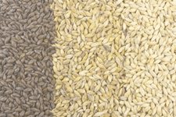
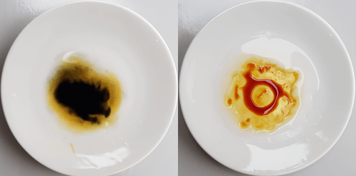

# Brouwproces - Basis {#basis}

```{block2, type="chapterintro"}
**Doelstellingen**

-  Je moet de verschillende stappen in het brouwproces kunnen benoemen.
-  Je moet in grote lijnen het hoe en waarom van deze stappen begrijpen.

```

## Het proces in grote lijnen {#b-start}

In grote lijnen gaat het maken van bier als volgt:

```{r brouwproces, echo=FALSE, fig.cap="Het brouwproces in grote lijnen.", out.width="100%"}

```

1.  Het zetmeel in de mout moet worden omgezet in suikers.
1.  De ontstane suikers moeten door de gist omgezet worden in alkohol.

Dit ziet er eenvoudig uit. In principe kun je een bier maken in een (soep)pan in de keuken. Maar het is toch wel een complex proces. Het gaat niet zomaar vanzelf. En om een goed bier te maken moet je wel wat meer weten over de afzonderlijke processen.

## Recept {#b-recept}

Om een bepaald bier te maken heb je een recept nodig. Hierin staat onder andere welke grondstoffen je nodig hebt en hoeveel daarvan.

In het begin krijg je zo'n recept vaak van anderen, maar al snel zul je een eigen recept willen opstellen. Daarover later meer.

## Mouten {#b-mouten}

Binnen in de gerstkorrel zit zetmeel. Om het zetmeel in suikers om te zetten heb je de hulp van verschillende enzymen (een bepaald soort eiwitten) nodig. Echter in onbehandelde brouwgerst zitten deze enzymen niet. Vandaar dat onbehandelde brouwgerst niet geschikt is voor het brouwen van bier.

```{r moutsoorten, echo=FALSE, fig.cap="Drie moutsoorten: van een donkere kleur naar een lichtere kleur.", out.width="40%"}

```

Om brouwgerst geschikt te maken, wordt het eerst gemout. Hierbij wordt de gerst geweekt in water. En als de gerst zich helemaal hiermee heeft volgezogen wordt het op een warme vloer uitgestort. Na enige tijd gaat de korrel ontkiemen en vormt dan enzymen. Zodra de gerst is ontkiemd, worden de graankorrels bij hoge temperatuur gedroogd om het kiemproces te stoppen. Het resultaat heet **mout**. En hoe hoger de temperatuur bij het drogen, des te donkerder de mout, zie figuur \@ref(fig:moutsoorten). De kleur van de mout bepaalt ook de kleur van het bier. De kleur wordt uitgedrukt in **EBC**, daarover later meer in \@ref(moutkleur). En ook heeft de mout een belangrijke invloed op de uiteindelijke smaak van het bier.

Dit mouten gebeurt in **mouterijen** en doe je niet zelf. Afhankelijk van het soort bier dat je wilt maken schaf je bepaalde mouten aan.

## Afwegen ingrediënten {#b-afwegen}

Als voorbereiding op het echte brouwen ga je alle ingrediënten eerst afwegen. Dat kan met een goede keukenweegschaal. Hou ook het maximaal toelaatbare gewicht van de weegschaal in de gaten.

## Schroten {#b-schroten}

Hele moutkorrels kun je niet gebruiken. De moutkorrels moeten eerst opengebroken worden. Dat heet **schroten**. Met behulp van een schrootmolen worden de korrels gekneusd zodat er een breuk in de korrel ontstaat waardoor het water bij het binnenste (het zetmeel) kan komen. Verwar het niet met fijnmalen. De kafjes die om de korrel zitten moeten zoveel mogelijk heel blijven, zie figuur \@ref(fig:schrootsel). Deze kafjes helpen je later bij het filteren van het bier. Als je het mout te fijn schroot kun je later problemen met het filteren krijgen. En ook loop je dan de kans dat er meer ongewenste stoffen uit de kaf van het mout vrijkomen, wat de kwaliteit van het bier niet ten goede komt.

```{r schrootsel, echo=FALSE, fig.cap="Mooi schrootsel, niet te fijn.", out.width="40%"}

```

Omdat geschrote mout snel in kwaliteit achteruit gaat kun je het beste de mout kort van te voren zelf schroten. Er zijn verschillende soorten schrootmolens voor de hobbybrouwer. Zie hiervoor hoofdstuk \@ref(apparatuur).

## Maischen {#b-maischen}

In deze stap moet het zetmeel in de mout door enzymen omgezet worden in suikers. Daartoe wordt in een ketel (maischpan) het geschrote mout toegevoegd aan een bepaalde hoeveelheid water. Dit wordt **inmaischen** genoemd. Het ontstane mengsel wordt **beslag** of ook wel **maisch** genoemd.

In het recept staat hoeveel **maischwater** je nodig hebt. De temperatuur waarbij je de geschrote mout toevoegt aan het water wordt de **inmaischtemperatuur** genoemd. Ook deze temperatuur staat in het recept.

Tijdens het maischen gaan verschillende enzymen aan het werk. Een bepaald enzym werkt het beste bij een bepaalde temperatuur en zuurgraad (pH) van de maisch. Op deze processen wordt in hoofdstuk \@ref(maischen) uitvoeriger ingegaan. Het beslag ga je onder rustig roeren opwarmen tot de temperatuur waarbij de enzymen het beste werken. En die temperatuur wordt dan een tijdje aan gehouden, het beslag krijgt een **rust**. Daarna wordt er opgewarmd tot een volgende temperatuur waarbij andere enzymen het beste werken en krijgt het beslag ook een bepaalde **rusttijd**. Een schema met de verschillende rusttijden en bijbehorende temperaturen heet een **maischschema**.

```{block2, type="tip"}
Om de temperatuur tijdens de rust constant te houden kun je de maischketel in een zogenaamde hooikist zetten of goed isoleren met een deken. Anders moet je zo nu en dan bijverwarmen.

```

Voor een goede werking van de enzymen is het ook noodzakelijk dat het maischwater een *pH* van 5,2-5,4 heeft. Meet daarom de pH en indien nodig zuur dan het water aan met wat melkzuur of fosforzuur. Zie hiervoor \@ref(zuurgraad).

### Jodiumtest {#b-jodiumtest}

Met een simpele **jodiumtest** kun je controleren of alle zetmeel is omgezet in suikers. Dit gaat als volgt.

1.  Doe een lepeltje maischbeslag op een wit schoteltje en laat dit afkoelen tot kamertemperatuur.
2.  Voeg 1-2 druppels jodiumtinctuur toe.
3.  Let nu op de kleur van de jodiumoplossing:
    -  *Blauwkleuring* wijst op de aanwezigheid van zetmeel. Je moet dan nog wat langer maischen.
    -  Blijft de kleur *bruin*, dan is alle zetmeel omgezet. Het maischproces is dan klaar.

```{r jodiumtest, echo=FALSE, fig.cap="Jodiumtest: Links blauwe kleur, nog zetmeel aanwezig. Rechts bruine kleur, geen zetmeel meer aanwezig.", out.width="40%"}

```

### Voortgang (SG) meten {#b-voortgang}

Dat er steeds meer suikers in de vloeistof komen kun je waarnemen door het SG (zie \@ref(sg-dichtheid)) van de vloeistof te meten. Dat kan o.a. met een hydrometer. Handiger is het gebruik van een refractometer omdat je hiervoor maar één druppel vloeistof nodig hebt. Zie hiervoor hoofdstuk \@ref(apparatuur).

Tijdens het maischen neemt ook de viscositeit van de vloeistof af, dat wil zeggen de maisch wordt minder stroperig en meer vloeibaar, dunner dus. Het roeren gaat daardoor steeds gemakkelijker.

Aan het eind van het maischen heb je een mengsel van een vloeistof, waarin de suikers zijn opgelost, met vaste stoffen, zoals kafjes en korrelresten van de mout. In de volgende stap wordt dit van elkaar gescheiden.

## Filteren {#b-filteren1}

Omdat je verder wilt met de suikeroplossing moet het mengsel aan het eind van het maischproces gefilterd worden. Je krijgt dan

-  **wort**, een heldere zoete vloeistof
-  **(bier)bostel**, de vaste bestanddelen die overblijven.

De bostel heb je voor de bierbereiding niet nodig. De meeste hobbybrouwers gooien het in de afvalcontainer. Het kan ook op de composthoop of als voer voor varkens en kippen gebruikt worden. Er zitten nog veel voedingsstoffen en vezels in. Daarom kun je een deel ervan ook gebruiken om er een (bier)brood mee te bakken.

Om deze scheiding uit te voeren heb je een filter nodig. Er zijn veel verschillende uitvoeringen van een wortfilter. Hobbybrouwers gebruiken vaak een *hevelfilter*, al dan niet zelf gemaakt. Zie hiervoor bij \@ref(apparatuur). De kafjes en korrelresten vormen hierbij het filterbed. Vandaar dat je niet te fijn mag schroten, want dan werkt het filterbed niet goed. De wort laat je in de kookketel (kookpan) lopen.

## Spoelen {#b-spoelen}

In het filterbed zitten nog veel suikers. Om die ook in de wort te krijgen wordt het filterbed met warm water (maximaal 78 ^o^C) langzaam en voorzichtig doorgespoeld. je begint met het spoelen als het filterbed begint droog te vallen.Om het rendement van het brouwproces te verhogen is het beter om langzaam te spoelen.

Indien mogelijk meet dan ook regelmatig met een refractometer het SG bij de uitloop van het filter. In het spoelwater zal steeds minder opgeloste suiker zitten, waardoor het SG van het spoelwater dus afneemt. Een vuistregel is dat het SG hier tussen 1,010 en 1,020 moet liggen.

In het recept is weer terug te vinden hoeveel **spoelwater** je nodig hebt. Ook het spoelwater moet een pH van ongeveer 5,4 hebben.

## Koken {#b-koken}

De wort gaat nu minstens een uur gekookt worden. Tijdens het koken ga je de hop toevoegen. In het recept staat weer hoe lang de *kooktijd* is en hoeveel gram van welke *hop* hoe lang moet meekoken. Zorg voor een zogenaamde "rollende kook".

Je kunt de hop op verschillende manieren aan de wort toevoegen.

+  Gewoon in de vloeistof doen. Om te voorkomen dat er na het koken teveel hopresten in het gistvat terecht komen, kun je na afloop
   -  de wort filteren.
   -  de hopresten laten bezinken en dan de wort overhevelen.
+  De hop in hopzakjes doen en dan aan de vloeistof toevoegen. Deze kun je na het koken uit de ketel halen.

Koken is om meerdere redenen erg belangrijk. Tijdens het koken

-  vlokken eiwitten uit, vooral in het begin. Deze kun je het beste met een schuimspaan afscheppen.
-  lossen bitterstoffen uit de hop op. Deze **bitterhop** moet minstens een uur koken en zorgt voor de kenmerkende bittere smaak van bier.
-  komen aromastoffen uit de hop in het bier. Deze **aromahop** kook je minder lang mee en hebben daardoor wat minder invloed op de bitterheid.
-  verdampen ongewenste vluchtige stoffen.
-  verdampt water, waardoor de concentratie van suiker toeneemt en het SG dus stijgt.
-  ontstaat een steriele vloeistof.

Het proces tot en met het koken noemt men de *warme kant* van het brouwproces. Het gedeelte van het brouwproces na het koken, dus tijdens het koelen, wordt de *koude kant* genoemd. De koude kant is gevoelig voor besmettingen!

Maak er verder een gewoonte van om het volume en het SG van de wort te meten, zowel voor het koken als na het koken.

```{block2, type="important"}
Na het koken moet je zeer hygiënisch te werk gaan!

```

## Koelen {#b-koelen}

Na het koken van de wort moet deze afgekoeld worden tot de temperatuur waarbij vergist gaat worden. De thuisbrouwer gebruikt hier meestal een *spiraalkoeler* of een *platenkoeler* voor. Zie hiervoor hoofdstuk \@ref(apparatuur).

## Filteren {#b-filteren2}

De afgekoelde vloeistof moet nu naar het *gistvat*. Echter er kunnen nog hopresten en eiwitvlokken in de wort zitten waarvan je liever niet wilt dat die in het gistvat terecht komen. In dat geval moet je de vloeistof filteren voordat deze het gistvat ingaat. Gelukkig zakken de vaste stoffen meestal naar de bodem om daar te bezinken, waardoor je de vloeistof kunt overhevelen.

Je kunt dit bezinken een handje helpen door een *whirlpool* maken. Hiervoor roer je flink rond met een grote roerspaan zodat er een draaikolk ontstaat. Daarna wacht je 10-15 minuten. Wanneer de vaste stoffen voldoende bezonken zijn kun je de vloeistof overhevelen naar het gistvat. Er blijft dan nog een klein beetje in de kookketel achter. Meet het volume dat naar het gistvat gaat, zodat je weet hoeveel er in de kookketel is achtergebleven.

## Gist toevoegen {#b-pitchen}

Eenmaal in het gistvat kan de gist toegevoegd worden. In het recept staat weer welke gist, hoeveel daarvan en of er een zogenaamde **giststarter** gemaakt moet worden. Korrelgist wordt vaak eerst gehydrateerd, maar je kunt het ook gewoon op de vloeistof strooien. Ook de temperatuur waarbij vergist moet worden vind je in het recept. In hoofdstuk \@ref(gist) wordt verder op de vergisting ingegaan, ook hoe je een giststarter moet maken en hoe het hydrateren van korrelgist in zijn werk gaat.

In het begin gaat de gist alleen maar zichzelf vermenigvuldigen, waardoor het aantal gistcellen toeneemt. Voor deze groei is zuurstof (lucht) nodig. Goed schudden van het gistvat zorgt ervoor dat er meer zuurstof in de wort komt. Na deze groeifase gaat de gist aan het werk om de suikers om te zetten in alcohol en koolzuurgas. Hierbij mag geen lucht (zuurstof) bij de vloeistof komen. Vandaar dat het gistvat van de lucht moet worden afgesloten, maar wel zodanig dat het ontstane koolzuurgas uit het gistvat kan ontsnappen. Hiervoor wordt vaak een *waterslot* gebruikt.

Meestal begint de vergisting binnen een halve tot hele dag. Er ontstaat koolzuurgas in de vorm van schuim en belletjes die via het waterslot verdwijnen Bij bovengistende bieren duurt de *hoofdgisting* meestal zo'n 2-5 dagen. Daarna neemt de snelheid van vergisting af en krijg je de periode van de *navergisting*. Sommige brouwers hevelen daartoe de vloeistof over naar een nieuw vat. Anderen doen dat juist weer niet omdat door het overhevelen de kans op een besmetting toeneemt.

## Lageren {#b-lageren}

Wanneer de vloeistof is uitvergist kan het gelagerd worden. Het *jongbier* kan dan rijpen en helder worden. Hiertoe hevel je het bier over in een ander vat. Dit vat moet zo vol mogelijk zijn om oxidatie van het jongbier te voorkomen. Sluit het vat wel af met een waterslot. Dit *klaren*  gebeurt het beste bij een lage temperatuur. Afhankelijk van het soort bier kan deze periode wel 2-8 weken duren.

De meeste thuisbrouwers slaan deze periode over. Wat velen wel doen is het gistvat aan het eind nog zo'n 3 dagen in de koelkast zetten. Hierbij zakt de gist beter uit naar de bodem en wordt het bier ook grotendeels geklaard. En wanneer je daarna gaat bottelen heb je met een koude vloeistof ook minder kans op schuimvorming.

## Bottelen {#b-bottelen}

Als laatste moet het bier afgevuld worden. Zeker in het begin zal dat in flessen zijn. Later mogelijk ook in vaatjes.

Je kunt pas met bottelen beginnen wanneer je zeker weet dat het bier is uitgegist. Zoniet, dan kan er teveel koolzuurgas in de fles terecht komen en loop je het risico van een "bom". De activiteit van de gisting kun je volgen door op het waterslot te letten. Maar een betere methode is door het SG met een hydrometer te meten. De vergisting is afgelopen wanneer het SG gedurende een dag of drie niet meer verandert en in de buurt ligt van het gewenste eind SG uit het recept. Dan kan er gebotteld worden.

Om voldoende koolzuurgas in flessenbier te krijgen moet er een *navergisting* in de fles plaatsvinden. Dat kan door nog wat suiker, zogenaamde *bottelsuiker*, aan het bier toe te voegen. De hoeveelheid hiervan is weer in het recept terug te vinden. Deze bottelsuiker wordt in een beetje water opgelost, aan de kook gebracht en daarna aan het jongbier toegevoegd. Bij deze navergisting ontstaat weer alcohol en koolstofdioxide. Door de fles af te sluiten kan het koolzuurgas niet meer weg en wordt het opgenomen in het bier. Het alcoholgehalte kan door deze navergisting met ca. 0,2%-0,5% toenemen.

Om er voor te zorgen dat de bottelsuiker goed vergist wordt moet je de flessen een kleine week op kamertemperatuur houden. Daarna de flessen zo koud mogelijk wegzetten.

Voor het afsluiten van flessen heb je kroonkurken nodig en voor het aanbrengen hiervan een kroonkurkapparaat. Je kunt natuurlijk ook bottelen in beugelflessen, dan heb je dat niet nodig.

## Rijpen en consumeren {#b-rijpen}

Na deze periode zet je de flessen rechtop staand en koud weg. De gist zal naar de bodem zakken en daar een droesem vormen. In de weken die volgen kan het bier rijpen, wat met name voor de donkere en zware bieren van belang is. Bewaar het bier weer niet te lang, want door veroudering (oxidatie) neemt de smaak af. Vooral de fijne hoparoma's die je o.a. in IPA's aantreft, verdwijnen.

Proef dus regelmatig!
