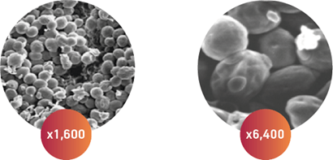
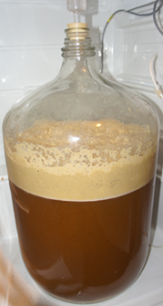
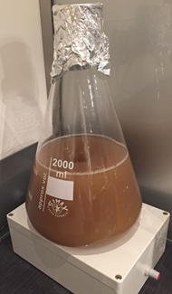

# Gist {#gist}

```{block2, type="chapterintro"}
**Doelstellingen**

-  Je weet wat gist is en wat het doet.
-  Je weet waardoor de werking van gist beinvloed kan worden.
-  Je kent het verschil tussen ondergisten en bovengisten.
-  Je kent het verschil tussen korrelgisten en vloeibare gisten.
-  Je weet hoe je de benodigde hoeveelheid gist voor een brouwsel kunt bepalen.
-  Je kunt aangeven wanneer je een giststarter moet gebruiken.
-  Je kunt een giststarter maken.

```

## Wat is en doet gist

Gisten zijn eencellige micro-organismen, behorende tot de schjimmels. De gist is verantwoordelijk voor het omzetten van wort in bier door suiker om te zetten in alkohol en koolstofdioxide. Tijdens de vergisting van de wort ontstaan diverse smaakcomponenten. Een zeer groot gedeelte van de smaak van het bier wordt bepaald door stoffen die gevormd zijn door de gist. De gebruikte gist bepaalt dan ook in belangrijke mate de smaak van het bier. Verander je van gist dan verandert ook de smaak van je bier. Het ontstaan van deze smaken is deels controleerbaar door de temperatuur en de soort gist.

```{r gistafbeelding, echo=FALSE, fig.cap="Microscopisch beeld van een droge bovengist (bron Fermentis).", out.width="40%"}

```

Om alcohol en CO~2~ te vormen, moet gist beschikken over

-  een *energiebron* : suiker (vergistbaar)
-  een *stikstofbron* voor groei en vermenigvuldiging: aminozuren, peptiden
-  mineralen

Deze zijn meestal voldoende aanwezig in de wort.

## Gistingsproces

In een **aeroob** (= zuurstofrijk) milieu gaat de gist zich vooral vermenigvuldigen en maakt geen alcohol. De gist moet zich in deze beginfase vooral bezig houden met groeien. Daarvoor is zuurstof nodig. Wanneer je voldoende gistcellen toevoegt hoef je de wort niet extra te beluchten. Ook wordt in deze fase de pH lager.  

Na de vermeerdering begint een **anaeroob** (= zonder zuurstof) proces, de hoofdgisting, waarbij de alcohol ontstaat. Deze fase verloopt meestal heftig en er ontstaat een dikke laag bruin schuim bovenop de vloeistof. Deze laag wordt ook wel *Krausen* genoemd, zie figuur \@ref(fig:krausen). Het ontstaan van zo'n laag is een zichtbaar teken dat de gist actief is en dat de gisting plaatsvindt. De Krausen bestaat voornamelijk uit levende en dode gistcellen, overtollige eiwitten en andere bijproducten van gistgroei, evenals enkele verbindingen afgeleid van de hop. Je kunt de Krausen ook zien als een indicator van hoe krachtig de gisting verloopt. Een langzame vergisting produceert een dunnere laag Krausen dan een snelle vergisting.

```{r krausen, echo=FALSE, fig.cap="Gistend bier met Krausen.", out.width="30%"}

```

Hoe hoger de temperatuur, des te sneller start de vergisting. Bij gebruik van een bovengist duurt de hoofdgisting hooguit een dag of drie. Daarna volgt een secundaire vergisting welke langzamer verloopt.

De temperatuur tijdens de vergisting is een kritische factor. Zo krijg je bij hogere temperaturen meer esters (fruitige aroma's). Voor sommige biertypes is dat wenselijk, voor andere biertypes juist niet.
Voor een goed bier is het belangrijk om de vergisting temperatuurgecontroleerd te laten verlopen. Veel thuisbrouwers maken gebruik van een oude koelkast die ze omgebouwd hebben tot een gistkast. Deze gistkast kan koelen en verwarmen wat door een thermostaat gestuurd wordt. Erg handig is het gebruik van een thermometer in de vorm van een digitale plakstrip die je op de buitenkant van het gistvat kunt plakken.

Aan het eind van de vergisting klonteren de enkele gistcellen samen tot vlokken van wel duizenden gistcellen. Daarna zakken deze vlokken uit naar de bodem van het gistvat. Giststammen vertonen verschillen in de mogelijkheid tot *uitvlokking (flocculatie)* en *uitzakking (sedimentatie)*. Dit proces wordt bevorderd door het gistvat na afloop van de vergisting koud (0-5 ^o^C) weg te zetten. Het bier wordt daardoor helderder. Ook een groot deel van de Krausen maakt deel uit van het sediment.

```{block2, type="tip"}
De beste manier om vast te stellen of de vergisting is afgelopen is door het SG te meten. Deze moet gedurende een paar dagen niet meer afnemen en in de buurt liggen van wat je als eind SG verwacht. De activiteit van het waterslot is een minder goede indicator.
```

## Gistsoorten {#gistsoorten}

In brouwerijen worden twee gistsoorten vaak gebruikt: Saccharomyces cereviae (bovengist) en Saccharomyces pastorianus (ondergist). van deze twee soorten zijn echter verscheidene *giststammen (ondersoorten)* die door brouwers gebruikt worden. In tabel \@ref(tab:tabel-gistsoorten) staan een aantal kenmerken van deze twee gistsoorten. De aangegeven temperaturen en tijden zijn indicaties. Raadpleeg altijd de gebruiksaanwijzing van de gebruikte gist.

```{r tabel-gistsoorten, echo=FALSE}
gistsoort <- data.frame(
	Kenmerk = c("Latijnse naam", "Temperatuur (C)", "Vergistingstijd", "Biersoorten"),
	Bovengist = c("Saccharomyces cereviae", "16-22", "3-6 dagen", "ales"),
	Ondergist = c("Saccharomyces pastorianus", "8-15", "2-6 weken", "pils")
)
gistsoort %>% 
	kbl(caption = "Kenmerken gistsoorten", position = "!ht", booktabs = TRUE) %>% 
	kable_styling(full_width = FALSE, bootstrap_options = "condensed", font_size = 12)
```

```{block2, type="tip"}
Er zijn ook gistsoorten die tussen een ondergist en bovengist zitten, die vergisten bij 15-16 ^o^C. Deze gisten worden ook wel *hybride* gisten genoemd.

```

## Verpakkingsvorm

De hobbybrouwer kan gist kopen als

-  korrelgist (gedroogde gist)
-  vloeibare gist.

Korrelgisten zijn goedkoper dan vloeibare gisten en ook het gebruik ervan is simpeler. Zo hoef je bij korrelgisten niet van tevoren een giststarter te maken. Van de vloeibare gisten is echter een groter assortiment voor specifieke biertypes leverbaar, alhoewel er steeds meer soorten korrelgisten op de markt komen.

```{block2, type="tip"}
Zowel korrelgist als vloeibare gist moet je in de koelkast bewaren. Minstens een uur voor gebruik haal je deze uit de koelkast om op de omgevingstemperatuur te laten komen.
```

### Korrelgist

Bekende leveranciers zijn Fermentis, Danstar/Lallemand en Mangrove Jack. Afhankelijk van de leverancier wordt korrelgist voor de hobbybrouwer geleverd in zakjes, meestal met 11,5 gram gedroogde gist. Voor het gebruik heb je de volgende mogelijkheden:

*  Direct over de wort in het gistvat strooien.
*  Eerst *hydrateren* en dan aan de wort in het gistvat toevoegen.
*  Eerst een *giststarter* maken en dan aan de wort in het gistvat toevoegen.

Een giststarter maken om meer gistcellen te hebben is bij korrelgist niet echt nodig. Korrelgist bevat voldoende gistcellen en zoniet, dan voeg je nog een extra zakje korrelgist toe.

En over het al dan niet hydrateren wordt verschillend gedacht. Bij een door fabrikant Fermentis uitgevoerde studie kon geen significant verschil worden aangetoond in levensvatbaarheid en vitaliteit van de gist bij direct instrooien en hydrateren. Direct instrooien is dan wel zo handig en gemakkelijk met minder kans op infecties.

#### Hydrateren van korrelgist {#hydrateren .unnumbered}

De massa water die je nodig hebt voor het hydrateren is ongeveer 10 keer de massa van de hoeveelheid te gebruiken korrelgist. Gebruik je 1 zakje met 11,5 gram korrelgist, dan heb je dus 115 gram (= 115 ml) water nodig. In plaats van steriel water kun je nog beter gehopte wort gebruiken, omdat de iso-alfazuren hierin een bescherming tegen infecties bieden.  Het hydrateren kun je het beste uitvoeren in een bekerglas, erlenmeyer, fles of kopje. Zorg wel dat deze schoon en gedesinfecteerd is. Het water moet je eerst even koken. Bij gebruik van glazen voorwerpen is een magnetron dan erg handig. Het water moet je daarna afkoelen tot 20-28 ^o^C.

```{block2, type="praktijk"}
**Hydrateren korrelgist**
	
1.  Desinfecteer de erlenmeyer.
1.  Voeg het water toe en laat het eventueel afkoelen tot 20-28 ^o^C.
1.  Strooi de korrelgist voorzichtig op de oppervlakte van het water. Niet roeren!
1.  Dek de erlenmeyer af met een stukje aluminiumfolie (ontsmetten!).
1.  Laat het mengsel 15 min. ongestoord staan.
1.  Roer het mengsel voorzichtig tot alle gist gesuspendeerd is (fijn verdeeld in het water).
1.  Laat de suspensie 10-15 min. ongestoord en afgedekt staan.
1.  Voeg kleine hoeveelheden afgekoelde wort aan de gistsuspensie toe. Roer voorzichtig. Ga hiermee door tot de temperatuur van het mengsel ongeveer gelijk is aan de temperatuur van de wort in het gistvat.
1.  Voeg de gistsuspensie daarna direct toe aan de wort in het gistvat.

```

### Vloeibare gist

De twee bekendste leveranciers zijn [Wyeast](https://wyeastlab.com/) en [White Labs](https://www.whitelabs.com/). Beide leveren vloeibare gisten in een verpakking die voldoende gistcellen bevat voor het vergisten van 20 liter wort met een SG van ongeveer 1,048. Voor een groter volume wort of voor bier met een hoger SG heb je meer gistcellen nodig, dus meer verpakkingen. Het alternatief is om een zogenaamde [giststarter] te maken.

```{block2, type="tip"}
Bij gebruik van vloeibare gist kun je het beste altijd een giststarter maken.

```

#### Wyeast

De vloeibare gisten worden geleverd in een zogenaamde *smack-pack*. Dit is een foliezak met binnenin vloeibare gist en een klein zakje met gistvoeding. Voor gebruik moet je tussen twee handen het kleine zakje kapot drukken (of slaan) zonder dat de grotere foliezak beschadigt. De gistvoeding komt nu bij de gist. Kneed en schud de zak zodat alles goed gemengd wordt. De gist gaat zich nu vermenigvuldigen en de zak zwelt hierdoor op. De duur van het groeiproces hangt af van de ouderdom van de gist en kan van een paar uur tot meer dan een dag duren.

Een overzicht van de beschikbare gisten kun je vinden op [Wyeast Yeast Strains](https://wyeastlab.com/beer-strains). Naast de eigenschappen van een bepaalde gistsoort vind je hier ook voor welk biertype een bepaalde gistsoort het meest geschikt is.

#### White Labs

Deze levert een geconcentreerde vloeibare gist, *PurePitch*, in een foliezakje. De gist is direct klaar voor gebruik.

Een overzicht van de beschikbare gisten en bijbehorende biertypes kun je vinden op [White Labs Yeast Bank](https://www.whitelabs.com/yeast-bank).

### Wilde gisten

Wilde gisten zijn gisten, die spontaan in de wort terecht komen en daar ook in gaan groeien. Dit gebeurt als de wort aan de buitenlucht wordt blootgesteld. Deze gisten behoren tot het geslacht *Brettanomyces*. Kenmerkend voor deze gisten is dat ze een lichtzurige fruitigheid opleveren. De Belgische geuze- en lambiekbieren staan er om bekend.

## Benodigde hoeveelheid gist

Voor een goede vergisting is het belangrijk dat je voldoende vitale gistcellen aan de wort toevoegt. Globaal heb je voor ondergistend bier twee keer zoveel gist nodig als voor bovengistend bier. En voor zwaarder bier heb je ook meer gist nodig.

Brouwsoftware kan voor je uitrekenen hoeveel gist je nodig hebt en ook hoeveel giststarter je eventueel moet maken. Ook zijn er op internet een aantal online rekenprogramma's te vinden die dat voor je kunnen uitrekenen. Daarnaast zijn er ook apps voor de mobiele telefoon beschikbaar. Zoek op "yeast calculator".

-  [**Mr. Malty's Pitching Rate Calculator**, Engelstalig](http://www.mrmalty.com/calc/calc.html)
-  [**Brewer's Friend Yeast Pitch Rate and Starter Calculator**](https://www.brewersfriend.com/yeast-pitch-rate-and-starter-calculator/)
-  [MoreBeer! Yeast Pitch Calculator](https://www.morebeer.com/content/yeast_pitch_calculator)
-  [**Homebrew Dad's Online Yeast Starter Guide**, Engelstalig](http://yeastcalculator.com/)

## Giststarter {#giststarter}

Een giststarter maak je om gistcellen te vermenigvuldigen, zodat er meer gistcellen beschikbaar komen, wat nodig kan zijn voor een groter volume wort of wort met een hoger SG. Het gebruik van een giststarter brengt de vergisting sneller op gang en ook zie je of de gist nog vitaal is. Bij gebruik van vloeibare gist wordt het maken van een gisstarter altijd aangeraden. Voor korrelgisten is het niet echt nodig, maar kan het om dezelfde redenen ook nuttig zijn.

Maak de giststarter 2-3 dagen voordat je de gist aan de wort wilt toevoegen. Het benodigde volume van de giststarter hangt af van het begin SG van de wort, de batchgrootte, de leeftijd van de gist en het al dan niet gebruiken van een magneetroerder. Gebruik een gistcalculator of brouwsoftware om uit te rekenen hoeveel giststarter je moet maken en hoeveel gist je daarvoor nodig hebt. Een vuistregel is zo'n 10% van de hoeveelheid te brouwen bier.

```{block2, type="tip"}
Wanneer je spoedig weer deze gist nodig hebt kan het handig zijn om wat meer giststarter te maken, zodat je het overblijvende deel in de koelkast kunt bewaren (of invriezen) voor later gebruik.
```

De beste voedingsbron voor de gist in een starter is maltose. Daarvoor maak je met moutextractpoeder een oplossing met een SG van ongeveer 1,040 (niet zwaarder). Een alternatief is om op een brouwdag 1-2 liter wort achter te houden, in te vriezen om deze dan later als voedingsbron voor de starter te gebruiken. Gebruik geen oplossing van kristalsuiker want dan heb je grote kans dat de vergisting van de wort minder goed verloopt.

Het is het handigste om meteen vanaf het begin alles in een erlenmeyer uit te voeren. Anders zul je met een steelpan en flessen moeten werken. De erlenmeyer moet voldoende groot zijn, ongeveer anderhalf keer de hoeveelheid giststarter, want er kan soms nogal veel schuim ontstaan. De erlenmeyer sluit je af met een gevouwen kapje van aluminiumfolie. Gebruik geen waterslot want er moet lucht (zuurstof) bij de gist kunnen komen.

Verder is het gebruik van een magneetroerder erg nuttig omdat voor de gistgroei zuurstof nodig is. De roersnelheid moet zodanig zijn dat een een kleine trechter (vortex) in de vloeistof getrokken wordt. Sneller roeren is niet nodig. Wanneer je niet over een roerder beschikt moet je de oplossing regelmatig schudden en zwenken zodat er zoveel mogelijk zuurstof in de oplossing komt. Een alternatief is beluchten met een steriel luchtfiltertje en een pompje.


```{r giststarter, echo=FALSE, fig.cap="Giststarter op magneetroerder", out.width="30%"}

```

```{block2, type="praktijk"}
**Recept voor 1 liter giststarter**

1.  Weeg 100 gram moutextractpoeder af en doe deze in een voldoend grote erlenmeyer.
1.  Voeg 1 liter kraanwater toe.
1.  Voeg eventueel gistvoedingszout toe (Optioneel)
1.  Roer goed en kook het mengsel 10-15 minuten.
1.  Dek de erlenmeyer af met een kapje van aluminiumfolie (gedesinfecteerd).
1.  Koel de erlenmeyer met inhoud in koud waterbad af tot kamertemperatuur.
1.  Voeg de gist (die op kamertemperatuur is) toe.
1.  Indien mogelijk roer zo'n 12-18 uur met een magneetroerder. Bij gebruik van oude gist duurt het proces langer en moet je ook langer roeren. Je kunt de afnemende activiteit waarnemen doordat er steeds minder schuim gevormd wordt. De kleur van de giststarter lijkt op die van koffie met melk. Laat de starter niet tot het einde doorgisten want dan neemt vitaliteit van de gist weer af.
1.  Stop met roeren/schudden. Bij gebruik van een magneetroerder de roervlo verwijderen. Hiervoor zijn handige magnetische hulpmiddelen beschikbaar zodat je de vloeistof niet besmet.
1.  De gist zal uitvlokken en een witte laag op de bodem vormen.
1.  Wanneer je de giststarter niet meteen gebruikt, zet deze dan in de koelkast, nog steeds met de aluminiumkap erop.

**Gebruik giststarter**

1.  Decanteer voorzichtig zo'n 80% van de heldere bovenste laag vloeistof, zonder de gistlaag op de bodem te verstoren.
1.  Wanneer de giststarter uit de koelkast komt, laat deze dan eerst op de temperatuur van de wort komen. Zorg dat daar voldoende tijd voor beschikbaar is.
1.  Schud de erlenmeyer zodat je een mooie suspensie van de gist krijgt.
1.  Voeg de gistsuspensie aan de inhoud van het gistvat toe.

```
