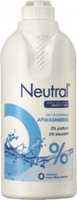

# Hygiene

Onderwerpen die aan bod komen:

-  Hygienisch werken.
-  Schoonmaken
-  Ontsmetten / desinfecteren

Alle apparatuur en hulpmiddelen moeten goed schoongemaakt zijn. En de onderdelen die je na het koken gebruikt moeten gedesinfecteerd zijn. En desinfecteren kan pas wanneer de spullen eerst schoongemaakt zijn.

Er zijn veel verschillende meningen over hoe je het beste schhon kunt maken en ontsmetten.

## Schoonmaken

Alles goed schoon maken is een eerste vereiste. Dat kan heel goed met water en een afwasmiddel. gebruik een neutraal afwasmiddel zonder geuren en kleuren.

## Ontsmetten

Er zijn behoorlijk wat ontsmettingsmiddelen te koop. Hieronder volgen een paar bekende. Ga niet werken met bleekwater, die laat een lucht achter (zelfs na goed naspoelen)

**Sulfiet met citroenzuur**

Sulfiet, Kaliumbisulfiet (K~2~S~2~O~5~) is verkrijgbaar als een wit poeder. Ook citroenuur is een wit poeder. Bij het maken van een oplossing met deze beide stoffen ontstaat gasvormig zwaveldioxide (giftig, gevaarlijk).

Voor het maken van 1 liter ontsmettingsmiddel:

-  1 liter water
-  1 gram sulfiet
-  0,5 gram citroenzuur (géén citroensap!)

Gebruik: De spullen moeten een tijd in deze oplossing ondergedompeld zijn. De inwerktijd is minimaal 2 uur. Een oplossing kan je een paar weken bewaren.

**Chemipro caustic**

Een chlooroplossing. Gebruik 1 gram per liter warm water. De inwerktijd is 15-20 min. Minstens 3x goed naspoelen met water.

**Chemipro Oxi**

Gebruik 4 gram per liter warm water. Contacttijd 2-5 minuten. Naspoelen mag, maar is niet nodig. 

**iodofor**

**Starsan**

**sani Clean**

