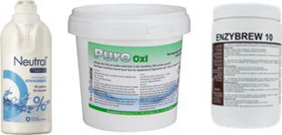

# Hygiene {#hygiene}

```{block2, type="chapterintro"}
**Doelstellingen**

-  Je moet weten hoe belangrijk het schoonmaken en desinfecteren is.
-  Je moet weten hoe en waarmee je apparatuur kunt schoonmaken en desinfecteren.
-  Je moet weten op welk moment in het brouwproces je moet desinfecteren.

```

## Schoonmaken

Alle apparatuur en hulpmiddelen moeten goed schoongemaakt zijn. Dat is een eerste vereiste. En de onderdelen die je na het koken gebruikt, dus tijdens de koude kant van het brouwproces, moeten gedesinfecteerd zijn. En desinfecteren kan pas wanneer de spullen eerst schoongemaakt zijn. Er zijn veel verschillende meningen over hoe je het beste schoon kunt maken en ontsmetten.

Schoonmaken is het verwijderen van vuil.

1.  Grof en aangehecht vuil kun je verwijderen met water en een zachte borstel. Nog beter is het gebruik van schoonmakpads. Deze hebben een groter reinigingsoppervlak. Let er op dat je geen krassen maakt met schurende materialen, vooral op plastic. In krassen gaat gauw vuil zitten waar je moeilijker bij komt en waar micro-organismen in gaan zitten.
2.  Maak hierna de spullen huishoudelijk schoon. Dat kan met water en een neutraal afwasmiddel  zonder geur- en kleurstoffen. Nog beter is het gebruik van speciale reinigingsmiddellen zoals de *Oxi-middelen* en *Enzybrew*.

```{r schoonmaakmiddelen, echo=FALSE, fig.cap="Van links naar rechts: (neutraal) afwasmiddel, oxi, enzybrew.", out.width="40%"}

```

## Desinfecteren

Alle brouwspullen die je tijdens de koude kant van het brouwproces gebruikt moeten gedesinfecteerd worden. Dit doe je om infecties te voorkomen. Met desinfecteren kun je pas beginnen wanneer de brouwspullen eerst grondig schoongemaakt zijn. Dus eerst schoonmaken en dan pas desinfecteren!

Desinfecteren is het terugbrengen van het aantal micro-organismen tot een aanvaardbaar niveau. Het is dus wat anders dan steriliseren, waarbij je alle micro-organismen verwijdert.

Er zijn behoorlijk wat desinfectiemiddelen te koop. Hieronder volgen een paar bekende. Ga niet werken met bleekwater, dat laat een chloorlucht achter (zelfs na goed naspoelen).

**Star San**

Star San van fabrikant Five Star (VS), is een sterk schuimend, zuur, anionisch ontsmettingsmiddel (desinfectans) op basis van fosforzuur (50%) en dodecylbenzeensulfonzuur (15%) dat zonder spoelen gebruikt kan worden. Het is zeer effectief, eenvoudig in gebruik en heeft een contacttijd van ca. 2 minuten nodig. Het is als een geconcentreerde vloeistof te koop die je voor gebruik moet verdunnen. Je hebt er maar weinig van nodig.

Eigenschappen:

+ Voedselveilig, veilig voor mens en omgeving (gebruik van handschoenen wordt aanbevolen).
+ Veilig voor gebruik op alle oppervlakken. Beperk contact met zachte metalen, rubber en kunststof tot een minimum. Wees voorzichtig, het is wel een zuur.
+ Schuimend, wat helpt bij het binnendringen van barsten.
+ Kleurloos en geurloos.
+ Naspoelen met water hoeft niet, mag wel.

Gebruik:

+ Maak een oplossing van 2 ml Star San per liter water.
+ Breng het aan met een spons, doek, spuitfles (plantenspuit) of gebruik het voor inweken van de spullen.
+ Laat het minstens 2 minuten inwerken, daarna uit laten lekken.
+ Oplossing kan 3-4 weken gebruikt worden wanneer het goed afgesloten bewaard wordt. Het is effectief zolang de oplossing een pH 3 of lager heeft.

**Chemipro Oxi**

Een ontsmettingsmiddel op basis van actieve zuurstof. Het is als poeder verkrijgbaar.

-  Dosering: 4 gram per liter warm water
-  Gebruik: Spoel of dompel de spullen onder. Contacttijd 2-5 minuten. Laat goed uitdruipen. Naspoelen mag, maar is niet nodig.

**Sulfiet met citroenzuur**

Sulfiet (Kaliummetabisulfiet) is verkrijgbaar als een wit poeder, net als citroenzuur. Bij het maken van een oplossing met deze beide stoffen ontstaat gasvormig zwaveldioxide (giftig, gevaarlijk). Sulfiet wordt door de hobbybrouwer steeds minder gebruikt.

-  Dosering: 1-2 gram gram sulfiet per liter water + 0,5 gram citroenzuur.
-  Gebruik: De spullen moeten een tijd in deze oplossing ondergedompeld zijn. De inwerktijd is minimaal 2 uur. Goed naspoelen met water.

```{r desinfectiemiddelen, echo=FALSE, fig.cap="Destinfectiemiddelen: Starsan en Chemipro Oxi", out.width="25%"}

```
