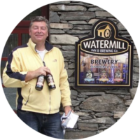

# Welkom {.unnumbered}

Dit is de online versie van een cursus voor het leren brouwen van bier.

De cursus is aanvankelijk opgezet voor een gedrukte handleiding bij een beginnerscursus van het [Twents Bierbrouwersgilde](https://www.twents-bierbrouwersgilde.nl/){target="_blank"}. Dit bracht zoveel enthousiasme bij mij te weeg dat ik het materiaal daarna verder geschikt gemaakt heb om als een online cursusboek te dienen. En er wordt nog steeds aan gewerkt om het cursusmateriaal verder te verbeteren en uit te breiden. Voor vragen, suggesties en andere reacties kun je een email sturen naar [brouwjebier](mailto:bwelman+brouwjebier@proton.me).

## Licentie {.unnumbered}

?

Dit werk valt onder een [Creative Commons Naamsvermelding-NietCommercieel-GelijkDelen 4.0 Internationaal-licentie](https://creativecommons.org/licenses/by-nc-sa/4.0/deed.nl).

## Over de auteur {.unnumbered}

Ben Welman

{.quarto-cover-image .image-fluid width="150"}Ik heb Chemische Technologie gestudeerd aan de THT, de huidige [Universiteit Twente](https://www.utwente.nl/) en tijdens de studie veelvuldig kennis gemaakt met bier, zowel theoretisch als practisch! Na eerst een aantal jaren scheikunde en wiskunde te hebben gegeven op middelbare scholen ben ik begonnen als docent informatica en statistiek bij de opleiding Commercieel Technische Bedrijfskunde van de Hogeschool Enschede, nu [Saxion Hogescholen](https://www.saxion.nl/). Van daaruit intern overgestapt naar een researchfunctie voor het ontwikkelen en ondersteunen van e-learning.

Na mijn pensionering heb ik meer tijd voor mijn hobby's: biljarten, bridgen, bierbrouwen, broodbakken en reizen (vooral met de Pössl en de fiets mee). Daarnaast hou ik nog wat tijd over om de studieboeken voor Access en Excel te onderhouden en me te verdiepen in data analyse met vooral [R](https://en.wikipedia.org/wiki/R_(programming_language)) en wat minder met [Python](https://www.python.org/).

Douwe Beimin

{.quarto-cover-image .image-fluid width="150"}De inhoud van deze cursus is mede tot stand gekomen door inbreng en feedback van Douwe Beimin, de organisator en docent van de brouwcursus en tevens secretaris van het Twent Bierbrouwersgilde. Waarvoor veel dank.
