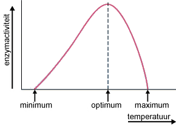
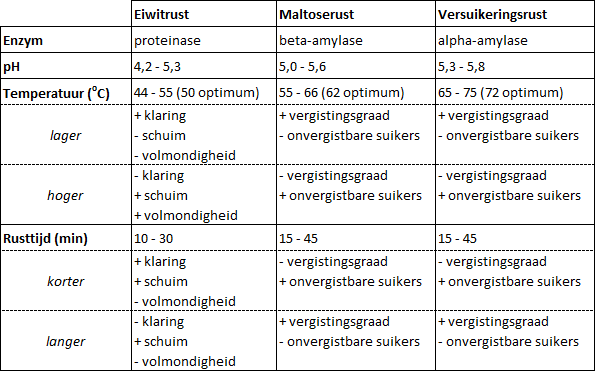

# Maischen {#maischen}

:::{.chapterintro}
**Doelstellingen**

-  Je weet wat de rol is van enzymen.
-  Je kent de temperatuur- en pH afhankelijkheid van enzymen.
-  Je kunt aangeven wat er bij de alfa-amylase gebeurt.
-  Je kunt aangeven wat er bij de beta-amylase gebeurt.
-  Je weet wat de invloed is van de tijdsduur en de temperatuur bij de maischstappen.
-  Je kunt een maisschema opstellen.
:::

## Enzymen

Tijdens het maischproces worden lange ketens zetmeel en eiwitten die in de mout zitten, omgezet in veel kleinere ketens, suikers en kleinere eiwitten. Die reactie wordt mogelijk gemaakt door enzymen die in de mout zitten. Bij deze omzetting zijn meerdere enzymen betrokken.

Een *enzym* is een eiwit dat als katalysator fungeert bij een bepaalde chemische reactie in of buiten een cel. Het enzym maakt de reactie mogelijk of versnelt de reactie, zonder daarbij zelf te worden verbruikt of van samenstelling te veranderen. De stof waar het enzym op inwerkt heet het *substraat*. ([Wikipedia](https://nl.wikipedia.org/wiki/Enzym))

De naam van een substraat eindigt op *ose*. En de naam van een enzym eindigt op *ase* en wordt voorafgegaan door het begindeel van de naam van het substraat. Ook is een enzym reactie- en substraatspecifiek, dat wil zeggen dat een enzym slechts één type reactie katalyseert bij een bepaald substraat. Een paar voorbeelden:

```{r tabel-enzymen, echo=FALSE}
mono <- data.frame(Substraat = c("maltose (moutsuiker)", "amylose (zetmeel)", "proteïne (eiwit)", "cellulose"), 
				   Enzym = c("maltase", "amylase", "proteinase", "cellulase"))
mono %>% 
	kbl(caption = "Substraten en enzymen", position="!h") %>% 
	kable_styling(full_width = FALSE, bootstrap_options = "condensed", font_size = 14)
```

Een goede werking van enzymen is afhankelijk van verschillende factoren. De belangrijkste zijn: temperatuur, pH, concentratie substraat, inwerkingstijd. Een enzym heeft één optimale temperatuur en één optimale pH-waarde. In \@ref(maischproces) wordt hier verder op ingegaan. En er zijn ook stoffen die de werking van enzymen ondersteunen. Zo is Calcium een belangrijke hulpstof voor amylase enzymen.

**Temperatuur**

Net als bij andere chemische reacties verlopen reacties waarbij enzymen betrokken zijn sneller wanneer de temperatuur hoger wordt. Echter bij een te hoge temperatuur kunnen enzymen degenereren waardoor ze niet meer werken. En deze degeneratie kan niet meer ongedaan gemaakt worden. De enzymactiviteit stijgt dus bij het toenemen van de temperatuur tot een maximale waarde en neemt daana weer af, zie figuur \@ref(fig:enzymactiviteit).

```{r enzymactiviteit, echo=FALSE, fig.cap="Verband tussen enzymactiviteit en temperatuur", out.width="40%"}

```

Elk enzym kent een dergelijk verloop, maar deze is voor elk enzym verschillend, evenals de optimale temperatuur.

**pH**

De activiteit van een enzym wordt ook beïnvloed door de zuurgraad. En net als bij de temperatuur in figuur \@ref(fig:enzymactiviteit) is er voor de pH een soortgelijke grafiek te maken met een bepaalde pH-waarde waarbij de enzymactiviteit optimaal is en een gebied daaromheen waarbij die activiteit minder is. En voor elk enzym is dat weer verschillend. Bij het omzetten van zetmeel naar suikers ligt deze tussen de 5,0 en 5,7. Zie verderop voor de verschillende enzymen.

**Concentratie substraat**

De snelheid waarmee de reacties verlopen is afhankelijk van de concentraties van de deelnemende stoffen. In het algemeen geldt hoe hoger de concentratie des te sneller de reactie.

De afbraak van zetmeel in suikers verloopt dus sneller wanneer de concentratie van het zetmeel hoger is, dus het beslag (de maisch) dikker is. Gedurende de reactie is er steeds minder zetmeel in de wort aanwezig waardoor de omzettingssnelheid dus afneemt en het proces langer gaat duren.

Je maakt een *beslag* door het geschrote mout aan het *maischwater* toe te voegen. De verhouding van de hoeveelheden water en mout bepaalt de dikte van het beslag. Een vuistregel is

-  lichtgekleurde drogere bieren: neem 3,5 liter water per kg mout.
-  donkere zoetige bieren: neem 2,5 liter water per kg mout.

## Maischproces {#maischproces}

Om de verschillende enzymen goed hun werk te laten doen wordt het maischen in een aantal stappen met verschillende steeds hogere temperaturen uitgevoerd. En bij elke stap wordt een bepaald rusttijd (inwerkingstijd) aangehouden. Deze temperatuurstappen met de bijbehorende rusttijden wordt het *maisschema* genoemd.

In grote lijnen zijn drie stappen (rustperiodes) te onderscheiden: *eiwitrust*, *maltoserust* en *versuikeringsrust*. Deze worden hierna verder uitgewerkt. Verder worden bij 78^o^ C alle enzymen onwerkbaar (gedenatureerd). Deze temperatuur wordt meestal ook 5-10 minuten aangehouden en zou je ook als een stap kunnen zien. Je hoeft niet altijd alle stappen uit te voeren. Zo wordt de eiwitrust nogal eens overgeslagen. En bij het maken van Engelse biersoorten wordt vaak maar één temperatuur aangehouden, een zogenaamde *eenstapsmaisch*. Het maischschema dat je gebruikt hangt af van de te maken biersoort en wordt in de recepten vermeld.

```{block2, type="tip"}
Bij het maken van een Weizen wordt ook nog een rust op 42^o^ C aangehouden. Bij deze temperatuur ontstaan stoffen die later voor de karakteristieke smaak en aroma van een Weizenbier zorgen: kruidnagel en banaan.
```

### Eiwitrust (Proteinaserust)

Temperatuurgebied: 44^o^C - 55^o^C, optimaal bij 50^o^ C.

Werkzame enzym: *Proteinase*

In deze stap worden de lange eiwitketens afgebroken tot kleinere ketens, onder andere aminozuren. Deze rust is van belang voor de klaring (helder worden) van het bier, de schuimstabiliteit, de body en een goede vergisting. Deze stap wordt vaak overgeslagen omdat tegenwoordig deze afbraak van de lange eiwitketens al in de mouterij is uitgevoerd. Vroeger was niet zo en vandaar dat deze stap in oude recepten bijna altijd aanwezig is. En wanneer je veel ongemoute granen gebruikt (> 20%) moet je deze stap in het recept opnemen.

```{block2, type="important"}
Eiwitrust (optioneel): zorgt voor betere schuimkraag en vergisting.

```

### Maltoserust (Beta-amylaserust)

Temperatuurgebied: 55^o^C - 66^o^C, optimaal bij 62^o^ C.

Werkzame enzym: *Beta-Amylase*

In deze stap wordt zetmeel afgebroken tot vergistbare suikers (maltose).  Deze rust is van belang voor de latere vorming van alcohol uit deze suikers. Bij een langere rusttijd krijg je dus meer vergistbare suiker en dus een droger en alcoholrijker bier. Bij een kortere rusttijd krijg je weliswaar minder alcohol, maar meer dextrine waardoor het bier een vollere smaak krijgt.

```{block2, type="important"}
Beta-amylaserust: zorgt voor meer alcohol en droger bier.

```

### Versuikeringsrust(Alpha-amylaserust)

Temperatuurgebied: 65^o^C - 75^o^C, optimaal bij 72^o^ C.

Werkzame enzym: *Alpha-Amylase*

Breekt het overgebleven zetmeel af tot vergistbare en vooral onvergistbare suikers (dextrines). Deze laatsten zorgen voor een volmondiger bier.

Aan het eind van deze stap voer je ook de jodiumtest uit om te onderzoeken of er nog zetmeel in het beslag zit. Zoja, dan moet je de rusttijd nog wat langer laten duren.

```{block2, type="important"}
Alpha-amylaserust: zorgt voor volmondiger bier.

```

### Samenvatting {#maischen-samenvatting}

In figuur \@ref(fig:maischtabel) zie je de belangrijkste kenmerken van de maischstappen. De aangegeven rusttijden zijn een indicatie van veel gebruikte tijden in recepten. Door in de maischstappen de temperaturen hoger of lager te maken en de rusttijden langer of korter heeft de brouwer veel invloed op het karakter en smaak van het uiteindelijke bier.

```{r maischtabel, echo=FALSE, fig.cap="Overzicht maischstappen, enzymen, pH en invloed temperatuur en rusttijd.", out.width="100%"}

```

En in figuur \@ref(fig:infusie-3staps) zie je een grafiek van het temperatuurverloop tegen de tijd bij een 3-staps infusieproces.

```{r infusie-3staps, echo=FALSE, fig.cap="Voorbeeld maischstappen in een infusieproces", out.width="100%"}

infusie3 <- tibble(tijd = c(0, 30,45,57,97,108,133,138,143),
					temp = c(20,50,50,62,62,72,72,78,78))
infusieplot <- ggplot(data = infusie3, aes( x = tijd, y = temp, label=temp)) +
	geom_line(size =1.2, colour =  "#E69F00") +
	geom_text(size=3, vjust= -0.8, hjust = 1) +
	labs(title = "Voorbeeld infusieproces (3-staps)", x = "Tijd (min)", y = "Temperatuur (C)") +
	theme_bw() +
	scale_x_continuous(breaks = seq(0,150,10)) + scale_y_continuous(breaks = seq(0,100,10)) +
	annotate("text", x=30, y=48, label = "proteinase", hjust = 0) +
	annotate("text", x=60, y=60, label = "beta-amylase", hjust = 0) +
	annotate("text", x=110, y=70, label = "alpha-amylase", hjust = 0)
infusieplot
```

```{block2, type="tip"}
Bij een eenstapsmaischproces ligt de temperatuur meestal aan de bovenkant voor de beta-amylase en aan de onderkant voor de alpha-amylase, zo $\pm 65^o C$. En een rusttijd van ongeveer 60 minuten. Beide enzymen doen dan hun werk, maar geen van beide optimaal. Ook hier kun je sturen door de temperatuur iets hoger of lager aan te houden. Het is wel belangrijk dat je bij deze methode de gekozen temperatuur goed constant houdt.
```

<!-- + [The Science of Step Mashing](https://byo.com/article/the-science-of-step-mashing/) -->
<!-- + [Enzymes in Beer: What’s Happening In the Mash](https://www.homebrewersassociation.org/how-to-brew/enzymes-in-beer-whats-happening-in-the-mash/) -->
<!-- + [Understanding Enzymes](https://byo.com/article/understanding-enzymes-homebrew-science/) -->
<!-- + [The Brewer’s Window: What Temperature Should I Mash at?](https://missionarybrewer.wordpress.com/2012/02/01/the-brewers-window-what-temperature-should-i-mash-at/) -->
