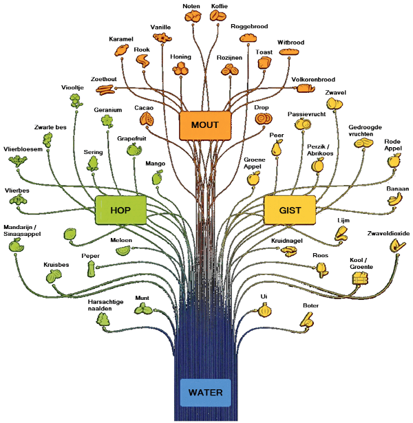

# Proeven {#proeven}

:::{.chapterintro}
**Doelstellingen**

-  Je maakt kennis met diverse aroma's en smaken in bier.
-  Je leert hoe je een bier moet proeven en beoordelen.
-  Je maakt kennis met een aantal veel voorkomende smaakafwijkingen.
-  Je leert welke brouwfouten veel voorkomen en hoe je die moet vermijden.
:::

## Aroma's en smaken

Op de tong kun je alleen de basissmaken waarnemen zoals *zoet*, *zout*, *zuur*, *bitter* en *umami*. Deze smaken zijn goed oplosbaar in water waardoor je ze via het speeksel kunt proeven op de tong. Umami is de hartige smaak (bijv. tomatenpuree, ansjovis, Parmezaanse kaas). Ook kun je op de tong nog de smaak van olie en vet waarnemen.

Aroma’s zijn de stoffen die er voor zorgen dat een sinaasappel naar een sinaasappel smaakt en een tomaat naar een tomaat. Aroma's zijn vluchtig, dat wil zeggen dat ze snel de lucht invliegen. Het waarnemen van aroma's doe je met de de neus.

Het proeven van bier bestaat voor ongeveer 80% uit het waarnemen van aroma's en voor 20% uit het waarnemen van smaken. Daarnaast neem je ook nog mondgevoel waar. (Bron: René Heubach, Grolsch smaakpanel)

Door Hans Wächtler van [bierbegeisterung.de](https://bierbegeisterung.de) is een *BIER_AROMABAUM* ontwikkeld. Een vertaalde versie is te zien in figuur \@ref(fig:bier-aromaboom). Hierin kun je zien van welke ingrediënten de diverse aroma's afkomstig zijn.

```{r bier-aromaboom, echo=FALSE, fig.cap="Bier-Aromaboom", out.width="80%"}

```

Als standaard voor de smaakanalyse wordt vaak het door Morten Meilgaard ontwikkelde smaakwiel gebruikt.

```{r smaakwiel, echo=FALSE, fig.cap="Smaakwiel voor bier", out.width="80%"}

```

## Hoe moet je proeven?

**Proefomstandigheden**

-  Rust
-  Geurvrij
-  Zuivere mond
-  Niet teveel

**Proeffasen**

1.  *Visueel*. De schuimbelletjes moeten klein en regelmatig zijn en het schuim moet aan het glas kleven en niet te snel inzakken.. Beoordeel verder de kleur.
2.  *Ruiken*. Dek het bier in het glas af zodat de geuren niet ontsnappen. Neem daarna een paar snelle snuifjes. Probeer goede en foute geuren te herkennen of te omschrijven.
3.  *Slikken*. Neem eerst een kleine slok en hou die in de mond. Zolang je het bier in de mond houdt proef je vooral de zoete en zure smaken. Probeer daarna het bier over de tong te laten rollen, zodat het met zoveel mogelijk smaakzones in contact komt. Ook de mondholte is belangrijk, want daarmee wordt vooral de alcohol waargenomen. Adem in en uit door de neus zodat de aroma's in contact komen met het reukorgaan. Slik daarna het bier door. Hierbij kun je de bitterheid het beste waarnemen.
4.  *Nasmaak*. Van belang hierbij is het type nasmaak (vaak hopbitterheid of moutige zoetheid) en de tijdsduur dat de nasmaak blijft hangen.

## Smaak- en geurafwijkingen {#afwijkingen}

Het kan zijn dat de geur en smaak van een bier afwijkt van hetgeen je verwacht had en waarvan de oorzaken veelal in de samenstelling van het recept liggen. Een paar voorbeelden.

-  **Bitterheid**. Deze kan te veel of te weinig zijn, wat komt door een verkeerde hoeveelheid hop.
-  **Kleur**. Deze kan te licht of te donker zijn, wat komt door een verkeerde hoeveelheid kleurmouten.
-  **Zoetheid**. Deze kan te veel of te weinig zijn en kun je sturen via het maischschema. Te droog bier kan veroorzaakt zijn door een te lange maltoserust bij 63^o^C. En het bier kan te zoet zijn door een te korte maltoserust bij 63^o^C.
-  **Moutigheid**. Deze kan te veel of te weinig zijn en kun je sturen via het maischschema.
-  **Schuim**. Bij te weinig schuim kan het zijn dat je een te lange eiwitrust bij 53^0^C hebt aangehouden. Ook te weinig bottelsuiker kan een oorzaak zijn. Wat tarwemout in de stort zorgt voor meer en beter schuim.

Vervelender is het wanneer er ongewenste smaken in het bier zitten. Daar zijn er veel van, maar sommige kom je regelmatig tegen en deze worden hierna besproken.

Een aantal afwijkende smaken komen van nature in bier voor. Sommige daarvan zijn zelfs nodig in bepaalde bieren en sommige zijn eigenlijk kenmerken voor specifieke stijlen. Het worden pas ongewenste smaken wanneer ze in te hoge concentraties aanwezig zijn of niet bij de bierstijl passen.

Daarnaast kunnen er ongewenste smaken zijn die afkomstig zijn van externe bronnen (besmetting, reinigingsmiddel, ...).

### Aangebrand

**Geur/Smaak**: aangebrand

**Mogelijke oorzaak**: Bij het maischen een te hoge verwarming of te weing geroerd.

**Remedie**: Meer roeren. Maischketel met dikkere bodem.

### Acetaldehyde

Ontstaat altijd tijdens de vergisting en wordt door de gist ook weer weggewerkt.

**Geur/Smaak**: groene appels, gemaaid gras

Stokkende vergisting, niet uitvergist.

**Remedie**: Zorgen voor goede vergisting (voldoende actieve gist), voldoende vergistingstijd, na bottelen in flessen zorgen voor voldoende tijd voor nagisting bij hogere temperatuur.

### Boterzuur

**Geur/Smaak**: ranzig, zuur, braaksel

**Mogelijke oorzaak**: Gevormd tijdens wortproductie en door bacteriën als gevolg van infectie.

**Remedie**: Hygienisch werken.

### Chlorophenol

**Geur/Smaak**: plastic, jodium, ziekenhuis, tandarts

**Mogelijke oorzaak**: Achtergebleven chloorhoudende reinigings- of desinfectiemiddelen.

**Remedie**: Gebruik deze middelen niet. En anders voldoende spoelen (ook kleppen, kranen, bochten)

### Diacetyl

Diacetyl is bijna altijd van nature in enige concentratie aanwezig in bier en behoort tot aromaprofiel.

**Geur/Smaak**: boter(babbelaar), popcorn, toffee

**Mogelijke oorzaak**: Vorming door gist tijdens de vergisting. In een later stadium wordt het weer afgebroken, maar bij een onvolledige vergisting gebeurt dat niet of onvoldoende. Aanwezigheid kan ook het gevolg zijn van een infectie.

**Remedie**: Voldoende actieve/gezonde gist gebruiken. Langer lageren.

### Dimethylsulfide (DMS)

Altijd aanwezig in bier, wordt gevormd bij het maischen en verdwijnt weer door koken. Behoort tot het aromaprofiel.

**Geur/Smaak**: Gekookte groente, bloemkool

**Mogelijke oorzaken**: Te hoge vergistingstemperatuur, te kort gekookt, kookketel afgedekt tijdens koken. Onhygiënisch gewerkt.

**Remedie**: Correcte vergistingstemperatuur. Langer koken. Lagere pH tijdens maischen.

### Dropachtig

**Geur/Smaak**: drop

**Mogelijke oorzaak**: Relatief te veel donkere moutsoorten.

**Remedie**: Minder donkere moutsoorten gebruiken. Kortere kooktijd aanhouden.

### Gistsmaak

**Geur/Smaak**: gist

**Mogelijke oorzaak**: Autolyse van gistcellen.

**Remedie**: Eerder overhevelen na hoofdgisting.

### Isovaleriaanzuur

**Geur/Smaak**: oude kaas, zweet.

**Mogelijke oorzaak**: gebruik van oude of slecht bewaarde hop. Vorming tijdens vergisting.

**Remedie**: Verse hop gebruiken. Hop luchtdicht in diepvries bewaren.

### Papery

**Geur/Smaak**: oude / natte kranten, karton.

**Mogelijke oorzaak**: te hoge bewaartemperatuur (> 15C) van bier. Wordt gevormd door oxidatie van vetzuren in bier.

**Remedie**: Oxidatie vermijden. Koel en donker bewaren.

### Zuur

**Geur/Smaak**: azijn(zuur), melkzuur, zuur

**Mogelijke oorzaak**: Bacteriële infectie.

**Remedie**: Hygienisch werken.

## Uitvoering

Praktisch invullen met een degustatie.
