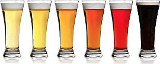

# Recepten

:::{.chapterintro}
**Doelstellingen**

-  Je weet hoe je aan een goed recept kunt komen.
-  Je kunt een bestaand recept aanpassen aan de eigen installatie.
-  Je kunt zelf een eenvoudig recept opstellen aan de hand van gewenste kenmerken.
:::

## Hoe verkrijg je een recept

Hoe kom je tot een recept voor een goed en succesvol bier? In het begin is dat niet eenvoudig en gebruik je snel een recept van een ander. Zeker wanneer je een volgens dit recept gebrouwen bier geproefd hebt en lekker vindt, kan dit vertrouwen in het recept geven. Soms moet je dan nog wat aan de hoeveelheden veranderen om het recept aan je eigen installatie aan te passen, maar daarna ben je snel klaar en daar is niets mis mee. Ook zijn er veel boeken en websites met recepten, teveel om op te noemen.

Een goed houvast biedt ook een gids met biertypen, zoals die van het BKG (BierkeurmeestersGilde) die in hoofdstuk \@ref(biertypen) wordt besproken. De gids geeft voor de biertypes een overzicht van de belangrijkste parameters en biedt daardoor een goed startpunt voor het formuleren van een recept.

Waar je als beginnend brouwer ook veel aan kunt hebben zijn de [Bewezen Recepten](https://www.hobbybrouwen.nl/forum/index.php?topic=4459.0) op het forum van Hobbybrouwen. Dit zijn recepten van bieren die ooit een prijs gewonnen hebben op een wedstrijd.

Het wordt wat anders wanneer je een bepaald bier wilt klonen of een bier wilt brouwen dat aan bepaalde kenmerken voldoet. Dan moet je het opstellen van een recept wat systematischer aanpakken. En om een goed recept te kunnen samenstellen moet je wat weten over de kenmerken van de verschillende grondstoffen en over de processen die plaatsvinden tijdens het maischen, koken en vergisten.

## De belangrijkste parameters voor een recept.

Bij het opstellen van een recept zijn de volgende 5 criteria het meest van belang:

1.	Begin SG
2.	Kleur
3.	Bitterheid en bitterheidsverhouding
4.	Alcoholpercentage
5.	Essentiële ingrediënten

Voor de eerste vier criteria vind je in de BKG biertypenlijst een waardenbereik van het criterium voor een bepaald biertype. Voor een nieuw recept kun je het beste beginnen door in het midden van dat bereik uit te komen. 

### Begin SG

Het begin SG geeft in feite aan hoeveel vergistbare stoffen in de wort zitten. Meestal wordt hiervoor als maat de dimensieloze relatieve dichtheid (zie ook \@ref(sg-dichtheid)) gebruikt. Voor de bieren uit de BKG biertypenlijst loopt het begin SG van 1,028 tot 1,120.

In hoofdstuk \@ref(rekenen) vind je aanwijzingen hoe je een schatting van het begin SG kunt maken op basis van de moutstort, het brouwvolume en het brouwhuisrendement.

Het begin SG is zowel bepalend voor het alcoholgehalte als de body van het bier. Bieren met een laag begin SG hebben doorgaans minder alcohol en body dan die met een hoog begin SG.

### Kleur {#bierkleur}



De kleur van het bier hangt voor het grootste deel af van de kleur en verhouding van de gebruikte moutsoorten en het brouwvolume. Voor een schatting van de bierkleur kun je het beste gebruik maken van brouwsoftware (zie hoofdstuk \@ref(brouwsoftware)).

Om de gewenste doelkleur voor het bier te krijgen moet je de moutstort aanpassen door meer of minder van een donkere mout te gebruiken.

### Bitterheid en bitterheidsverhouding

In hoofdstuk \@ref(rekenen) vind je aanwijzingen hoe je een schatting van de bitterheid (EBU) kunt maken op basis van de hoeveelheid hop, het alfazuurpercentage hiervan en de kooktijd van de hop.

Naast de bitterheid van de hop is ook de balans met de zoetheid van de mout van belang. Dit kan uitgedrukt worden met de bitterheidsverhouding (BV).

$BV = \frac{EBU}{SG_{punten}}$

De benodigde bitterheidsverhouding hangt van het biertype af. Bittere bieren zoals een IPA, hebben een hogere bitterheidsverhouding dan licht gehopte bieren zoals een Weizen. Om de juiste bitterheidsverhouding te bepalen kun je uitgaan van het gemiddelde waardenbereik uit de bierypenlijst. Zie twee voorbeelden in tabel \@ref(tab:biertype-bv).

```{r biertype-bv}
biertype.bv <- data.frame(
    bt = c("IPA (USA", "Weizen"),
    og = c("1,056-1,070", "1,046-1,057"),
    sgpt = c(63, 52),
    ebu = c("40-70", "10-20"),
    ebugem = c(55, 15),
    bv = c("55/63 = 0,87", "15/52 = 0,29")
)

biertype.bv %>% 
    kbl(col.names = c("Biertype", "Begin SG", "Gemid. SGpunten", "EBU", "Gemid. EBU", "BV"), 
        caption = "Twee biertypes en hun bitterheidsverhouding (BV)") %>%
    kable_styling(full_width = FALSE, bootstrap_options = "condensed", font_size = 14)
```

### Alcoholpercentage {#recept-alcoholpercentage}

Het volumepercentage alcohol (ABV = Alcohol By Volume) kan worden berekend uit het begin SG en het eind SG, zie \@ref(rekenen-alcoholpercentage). Bij het samenstellen van een recept zijn twee zaken van belang voor het uiteindelijke alcoholpercentage:

+ *Begin SG*. In het algemeen geldt hoe hoger het begin SG, hoe hoger het alcoholpercentage.
+ *Gistsoort*. Sommige gistsoorten zijn effectiever in het omzetten van suikers in alcohol dan andere gistsoorten.

### Essentiële ingrediënten

Voor sommige biertypes zijn bepaalde ingrediënten essentieel. Ook hiervoor biedt de biertypengids meestal uitkomst. Zo moet de moutstort voor een Weizen uit minimaal 50% tarwemout bestaan. En ook heb je voor de kenmerkende banaan- en kruidnagelsmaak van een Weizen een speciale Weizengist nodig.

## Aanpassen van een bestaand recept

Wanneer je volgens een bestaand recept van iemand anders wilt brouwen, kan het zijn dat je dit recept wat aan moet passen. Vaak moet het bottelvolume gewijzigd worden in het volume voor je eigen installatie. En ook kunnen de verliezen en brouwhuisrendement anders zijn. Hierdoor moet je de hoeveelheden mout, water, hop  en soms gist aanpassen. Gebruik van brouwsoftware is ook hier gemakkelijk omdat deze vaak over schalingsmogelijkheden beschikt en daardoor automatisch alle hoeveelheden kan aanpassen.

Het kan ook zijn dat je een van de ingrediënten wilt wijzigen, bijvoorbeeld omdat een bepaald ingrediënt niet meer voorradig of te koop is, of omdat je wat anders nog op voorraad hebt. Op internet zijn hiervoor substitutielijsten te vinden.

## Werkwijze nieuw recept

Voor de ontwikkeling van een recept is het raadzaam om dit gestructureerd te doen. Het standaardboek op dit gebied is Designing Great Beers [@danielsDesigningGreatBeers1996]. Hierin wordt een zes stappenplan beschreven dat er als volgt uitziet.

1.  Bepaal hoeveel en welk bier je wilt maken en wat de kenmerken van dit bier moeten zijn.
    +  bottelvolume
    +  gisttype (bovengistend, ondergistend, wilde gisting)
    +  begin SG
    +  bitterheid (IBU)
    +  kleur (EBC)
    +  gewenste moutkenmerken
    +  gewenste hopkenmerken
    +  gewenste smaak- en geurkenmerken
    +  gewenste speciale ingrediënten (kruiden, ...)
2.  Bepaal welke moutsoorten je wilt gebruiken en bereken de hoeveelheden hiervan.
    +  basismout(en)
    +  speciale mout(en)
    +  maischschema
3.  Bereken de hoeveelheden water en ga na of je het water moet behandelen.
    +  waterprofiel
    +  eventuele behandeling (pH, brouwzouten)
4.  Bepaal welke hopsoorten je wilt gebruiken en bereken de hoeveelheden.
    +  gewenste hoparoma en smaak
    +  tijdstip(en) en tijdsduur hopgiften
    +  vlamuit hopping of dryhopping gewenst?
5.  Bepaal welke gist je wilt gebruiken en stel een plan voor de vergisting op.
    +  gistsoort (vergistingsgraad, uitvlokking, esters)
    +  hoeveelheid gist
    +  giststarter nodig?
    +  vergistingstemperatuur
    +  diacetylrust nodig?
    +  lagering nodig?
6.  Bepaal welke punten van belang zijn voor de afhandeling aan het eind.
    +  klaring (natuurlijk of met hulpmiddelen)
    +  verpakken
       *  bottelen (bottelsuiker, bottelgist, hergistingstemperatuur en -tijd)
       *  fust (koolzuurdruk en verzadigingsmethode)

Een handige gids is de Biertypengids van Derek Walsh [@walshBiertypengids2002]. In deze gids vind je een overzicht van biertypen met uitgebreide technische specificaties, bijzonderheden en receptaanwijzingen voor elk biertype. Helaas is deze biertypengids niet meer te koop. De [BKG Biertypenlijst](https://www.bierkeurmeestersgilde.nl/biertypenlijst) is hieruit voortgekomen. Hierin worden ook de biertypen beschreven met hun kenmerken, maar geen recepturen. De lijst is vooral belangrijk wanneer je met jouw gebrouwde bier mee wilt doen aan een wedstrijd.

Een nuttig artikel dat je kan helpen bij het samenstellen van recepten is [Samenstellen bierrecepten](https://www.hobbybrouwen.nl/artikel/samenrec.html) van Jacques Bertens, op de site van Hobbybrouwen. Je start hier met de keuze van een biertype. Wanneer het gewenste biertype niet in de tabel staat kies je een type dat er het dichtst bij in de buurt komt.

### Voorbeeld: Weizen

Je wilt een recept samenstellen voor een Duitse Weizen. Om wat speelruimte te hebben neem je voor de technische specificaties de gemiddelde waarden in de BKG biertypenlijst. Een Duitze Weizen moet voor 50% - 70% uit tarwemout bestaan. Daar moet je een keuze uit maken.

+ Begin SG: 1046–1057 => keuze 1052
+ Alcoholpercentage (ABV): 4,5-5,9% => keuze 5,2%
+ Kleur: 6-25 EBC => keuze 15 EBC
+ Bitterheid: 10-20 EBU => keuze 15 EBU
+ Kooktijd: 75 min
+ Bitterheidsverhouding = 15/52 = 0,29
+ Ingrediënten:
  - Mout: 65% tarwemout, 35% pilsmout
  - Hop: Zuid-Duitse hop, bijvoorbeeld Hallertau Perle
  - Gist: korrelgist geschikt voor tarwebieren, bijvoorbeeld Fermentis SafAle WB-06

Voor het maischschema, koken en vergisting worden de aanwijzingen in het boek van Derek Walsh [@walshBiertypengids2002] opgevolgd.
