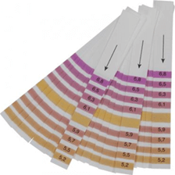

# Water {#water}

```{block2, type="chapterintro"}
**Doelstellingen**

-  Je moet enige kennis hebben van wat de invloed van de watersamenstelling is op het bier.
-  Je moet weten welke rol de pH waarde vervult bij het brouwproces.
-  Je leert hoe je de pH kunt meten en de waarde kunt wijzigen.
-  Je weet wat de invloed is van zouten in het brouwwater en wat je ermee kunt doen..

```

## Soort water

Water wordt door de bierbrouwer in grote hoeveelheiden gebruikt als

-  **brouwwater** in de vorm van maischwater en spoelwater.
-  **proceswater** voor het reinigen van de apparatuur en de koeling van de wort.

Voor het brouwen van bier is de kwaliteit en samenstelling van het brouwwater van belang. Grote brouwerijen hebben vaak hun eigen waterbronnen. De anderen doen het met kraanwater. Zo bevat het water in de Achterhoek meer mineralen (is harder) dan het water in Zuid-Limburg. Ook voor het maken van bepaalde biertypes is dit van belang. Twee bekende plaatsen in deze zijn

-  *Pilsen* (Tsjechie) met zeer zacht water dat ideaal is voor een pils
-  *Burton-on-Trent* (Engeland) met zeer mineraalrijk water dat ideaal is voor sterker gehopte bieren zoals een IPA.

Eigenlijk heb je alleen voor pilsbieren zeer zacht water nodig. Voor de meeste bovengistende bieren is wat harder water beter.

Naast de hardheid van het water speelt ook de zuurgraad (pH) een rol bij verschillende processen tijdens het brouwen. Vandaar dat hierna aan deze twee aspecten de nodige aandacht besteed wordt. De samenstelling van jouw kraanwater kun je bij het waterleidingbedrijf opvragen. Voor Vitens zie [Waterkwaliteitsoverzichten](https://www.vitens.nl/service/waterkwaliteit/waterkwaliteitsoverzichten)

## Zuurgraad {#zuurgraad}

De pH is een maat voor de *zuurgraad* van een waterige oplossing. De pH van een neutrale waterige oplossing ligt bij kamertemperatuur rond de 7. Zure oplossingen hebben een pH lager dan 7 en basische oplossingen hebben een pH hoger dan 7.

```{block2, type="tip"}
Hoe zuur een oplossing is wordt bepaald door het aantal $H_3O^+$ ionen. De pH wordt hieruit berekend via de negatieve logaritme van de concentratie van deze ionen. In de scheikunde wordt de concentratie van een deeltje genoteerd met vierkante haken (blokhaken). De pH  bereken je dan met de volgende formule: $pH = -log([H_3O^+])$
```

In de praktijk lopen de pH waarden van 1 tot 14. Bedenk wel dat de pH-schaal logaritmisch is, wat inhoudt dat een klein verschil in pH waarde al voor een groot verschil in de zuurheid kan zorgen.

Vooral bij het maischen speelt de pH een belangrijke rol. De enzymen werken het beste bij een pH van 5,2-5,6. Ook bij het koken met hop verloopt het extraheren van de bitterstoffen uit de hop het beste in dit pH waardengebied.

De pH van het brouwwater zelf heeft maar een beperkte invloed op het brouwproces. Belangrijker is de pH van het beslag tijdens het maischen. Deze wordt beïnvloedt door de samenstelling van de mout en de zouten in het brouwwater. Zo ligt de pH van een beslag dat alleen van pilsmout gemaakt is tussen de 5,7 en 5,8. Iets te hoog dus voor een ideale werking van de enzymen. Donkere mouten geven een wat lagere pH. Het kan dus zijn dat je net goed uitkomt bij een mengsel van basismouten met wat donkere mouten.

### pH meten en aanpassen

Wanneer je de pH van het beslag gaat meten kun je dat het beste zo'n 10 minuten na het storten van de mout doen, die wachttijd is nodig voor het stabiel worden van de pH. 

Het goedkoopst kun je de pH meten met pH strips. Deze zijn te koop voor verschillende pH gebieden. Koop strips die het pH bereik voor de amylase goed afdekken, zoals het bereik 5,2-6,8 zoals je kunt zien in figuur \@ref(fig:ph52-68).

```{r ph52-68, echo=FALSE, fig.cap="pH strips voor het bereik 5,2-6,8.", out.width="30%"}

```

Voor het uitvoeren van een meting voeg je met een druppelpipetje of een lepeltje een paar druppels aan het testgebied van het papier toe, wacht even tot de strip verkleurd is en vergelijk dan de kleur met de kleurenschaal en lees de pH waarde af.

Het gebruik van pH papier is geen erg nauwkeurige methode, maar voor de hobbybrouwer vaak voldoende. Het gaat er immers om dat je in het pH gebied 5,3-5,5 zit. Wil je een nauwkeuriger waarde dan moet je een pH meter aanschaffen. Deze is niet alleen duurder maar moet je ook regelmatig calibreren met speciaal daarvoor gemaakte oplossingen.

Je kunt de **pH verlagen** door het toevoegen van melkzuur of fosforzuur en de **pH verhogen** (wat niet vaak voorkomt) door het toevoegen van natriumbicarbonaat of calciumcarbonaat. Een methode voor het verlagen van de pH die je in Duitse recepten wel eens tegenkomt is door *zuurmout* (Sauermalz) in de moutstort te gebruiken, je zondigt dan niet tegen het Reinheitsgebot.

```{block2, type="tip"}
Wanneer je over de watersamenstelling van het drinkwaterbedrijf beschikt kun je ook redelijk goed de pH van het brouwsel vooraf inschatten met brouwsoftware en tevens bepalen welke correcties je moet uitvoeren.
```

\newpage
## Hardheid

In kraanwater kunnen diverse ionen voorkomen. De voor de brouwer belangrijkste zijn

-  Calcium, Magnesium en Waterstofcarbonaat: verantwoordelijk voor de hardheid van het water (meestal uitgedrukt in graden Duitse Hardheid).
-  Fosfaat: belangrijk voor de groei van gistcellen, komt ook via de mout in het beslag.
-  Chloride: zorgt voor een vollere smaak van het bier.
-  Sulfaat: versterkt de bitterheid van het bier.

Voor invloed op de smaak is vooral de onderlinge verhouding Chloride en Sulfaat van belang. Als deze onderlinge verhouding klein is, accentueert dit de bitterheid, van belang voor bijvoorbeeld een IPA. Een hogere onderlinge verhouding levert een accentuering van zoetheid op, van belang bij bokbieren.

Het komt in de praktijk weinig voor dat je het water moet ontharden. Maar wanneer het water te hard is voor het te brouwen biertype, dan kun je tijdelijke hardheid, veroorzaakt door waterstofcarbonaat, verminderen door het vooraf te koken. Een andere oplossing is door gedemineraliseerd water te gebruiken.

Door het toevoegen van zogenaamde brouwzouten als calciumchloride en calciumsulfaat kun je de hoeveelheid mineralen in het water verhogen en ook nog eens de pH verlagen. Het toevoegen van calciumzouten zorgt er ook voor dat de gist beter uitvlokt waardoor het bier eerder helder is. Ook hier kan brouwsoftware je ondersteunen om de toe te voegen hoeveelheden te berekenen.

**Alkaliniteit**, ook wel carbonaathardheid genoemd, geeft de concentratie carbonaten en bicarbonaten in het water aan. Het is een maat voor het bufferend vermogen van een oplossing. Een pH-buffer zorgt voor het opvangen van schommelingen in de pH waarde. Een goede alkaniliteit van je brouwwater houdt de pH waarde stabiel.
