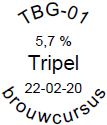

# Notities (WIP)

## Klaring met gelatine

Na de lagering en voor het bottelen kun je desgewenst het bier klaren met gelatinepoeder. Het gaat als volgt.

1. Koel het bier af tot onder de 10^o^C.
1. Maak een gelatineoplossing. Voor 20 liter bier voeg je 5 gram gelatinepoeder toe aan 60 ml koud water. Zet deze in de magnetron en geef achter elkaar stoten van 7 sec. Roer na elke stoot met de onderkant van de thermometer. Ga hiermee door tot de oplossing een temperatuur van 63^o^C-65^o^C heeft.
1. Voeg de gelatineoplossing toe aan het koude bier en roer deze er voorzichtig door heen.
1. Laat het bier verder afkoelen naar een temperatuur dicht bij 0^o^C en laat het zo'n 2-3 dagen staan.
1. Daarna kan het bier gebotteld worden.

Voor andere klaringstechnieken zie http://byo.com/recipes-tag/item/645-fining-your-beer-techniques.

## Etiketten

Boven op de dop passen ronde etiketten van Herma No. 4386, doorsnede 20mm. Met de (gratis) software Herma Label Designer 1.1 NL kun je deze etiketten erg mooi bedrukken, ook met ronde tekst. Het voordeel hiervan is dat je later het etiket niet meer van de fles hoeft los te weken.

Voor het maken van fraaiere etiketten is online software beschikbaar, zoals

+ [Beer Labelizer](https://www.beerlabelizer.com/). Je kunt kiezen uit een aantal voorgedefinieerde ontwerpen, deze van eigen tekst voorzien, een eigen afbeelding toevoegen en daarna het etiket afdrukken of als een afbeelding (jpeg, png) bewaren.
+ [Labeley](https://labeley.com/). Je kunt kiezen uit aantal ontwerpen die je aan kunt passen met eigen achtergronden, afbeeldingen en teksten. Wanneer je het ontwerp wilt bewaren moet je eerst een account aanmaken.

## Gist

Gist is een eencellig levend organisme dat suiker omzet in alkohol en koolstofdioxide. Tijdens de vergisting ontstaan diverse smaakcomponenten. Een zeer groot gedeelte van de smaak van het bier wordt bepaald door stoffen die gevormd zijn door de gist. De gebruikte gist bepaalt dan ook de smaak van het bier. Verander je van gist dan verandert ook de smaak van je bier. Het ontstaan van deze smaken is deel controleerbaar door de temperatuur en de soort gist.

In een zuurstofrijk milieu gaat de gist zich vooral vermenigvuldigen en maakt geen alcohol. Ook wordt de pH lager. Voor een giststarter waar het je om de vermenigvuldiging van de gist te doen is moet je dus vooral goed beluchten. Wanneer je bij de vergisting gebruik maakt van een goede giststarter met voldoende gistcellen, hoef je de wort niet te beluchten. De gist moet zich dan vooral bezig houden met het maken van alcohol.

Pitching Rate: de verhouding tussen de gist en de wort (gram korrelgist per liter wort).

Gist gaat niet zo snel dood, maar gaat wel "slapen" bij

+ een temperatuurschok, als de starter een andere temperatuur heeft dan de wort.
+ een groot verschil in suikerprofiel tussen starter en wort. De suiker in de wort bestaat vooral uit maltose.
+ langdurig bewaren. Gist ouder dan 1 jaar kun je nog prima gebruiken, maar het duurt dan wel enkele dagen tot een week voordat de gist levendig is.
+ Autolyse treedt niet snel op, behalve wanneer er druk op de gist wordt uitgeoefend, bijvoorbeeld door veel vloeistof er boven. Bij de huisbrouwer is autolyse geen punt, maar bij grote brouwerijen kan het snel gaan.
+ Mixen van giststrains geeft de voordelen van beide.

Luie gist:

+ Gist wordt lui van gemakkelijke suikers. Bij veel gemakkelijke suikers begint de gist dan niet aan moeilijker suikers zoals maltotriose.
+ Het toevoegen van suiker, kandij, honing kun je daarom beter niet tijdens het koken toevoegen. Voeg deze in het gistvat toe aan het einde van de hoofdvergisting.
+ Sommige giststammen zijn uit zichzelf lui, bijv. korrelgist S-33. Deze is daarom vooral geschikt voor zoete bieren.
+ Een gistcel maakt zo'n 4-5 baby's.
+ Pas op voor wilde giststammen. Deze eten de suikers op die de biergisten laten liggen.. Geeft dan een grotere kans op plofflessen.

Bewaren van de gist

Gist kan behoorlijk lang bewaard worden.

+ In de koelkast kan gist in een jampotje ideaal 1-3 dagen bewaard worden, tot 2 weken kan ook nog wel, maar n 4 weken zijn de helft van de gistcellen dood. Voor gebruik eerst een starter maken. Tip: je kunt de gist activeren door vloeistof af te gieten en verse wort toe te voegen.
+ Ca. 2 jaar in een diepvriezer.

Er zijn twee soorten gist verkrijgbaar: gedroogde gist (korrelgist) en vloeibare gist (reinculturen van Wyeast of White Labs). Daarnaast kun je ook zelf gist opkweken uit flessen commercieel bier waarin gist zit. Het is belangrijk dat de gist die aan de wort toegevoegd wordt, voldoende gezonde en actieve gistcellen bevat. Daarom wordt er vaak een gistarter gemaakt die bij de wort gedaan wordt.

Fusel alcoholen (fusel oils) zijn mengsels van verschillende soorten alcoholen (vooral 1-propanol en isoamylalcohol), geproduceerd als bijproduct van de alcoholische vergisting.

Tips:

+ Maak altijd een giststarter. Ook als de verpakking korrelgist of vloeibare gist voldoende is voor de hoeveelheid wort. Je weet dan altijd zeker dat de gist ook actief is.
+ Maak ook een starter bij korrelgist, want daardoor verdwijnt de korrelgistsmaak (bron: Grolsch)
+ Heb korrelgist paraat wanneer de giststarter niet binnen 36 uur actief wordt.

Gist calculators:

+ [YeastCalc](http://www.yeastcalculator.com/)
+ [MrMalty](http://www.mrmalty.com/calc/calc.html)

Overzicht en vervangers:

+ [Homebrew Yeast Strains Chart](https://byo.com/article/yeast/), hiermee kun je voor een bepaald biertype de geschikte gistsoorten vinden. Erg handig.

## Gist kweken

### Gistslurry invriezen

Voor het invriezen van gistslurry heb je glycerine 33% nodig.

Glycerine uit winkel bevat meestal 80% glycerol en 20% water. Aan 10 ml van dit mengsel voeg je 14 ml water toe om de gewenste concentratie van 33% glycerol te krijgen. Doe dit mengsel in een kleine erlenmeyer, dek af met magnetronfolie en kook het mengsel kort in de magnetron.

Schenk een deel van de slurry in een gedesinfecteerde maatcilinder, want slurry schenken vanuit de grote erlenmeyer met giststarter is niet handig. Vul de cryobuisjes voor ongeveer 40% met deze gistslurry. Hieraan een evengroot volume glycerine 33% toevoegen, die vooraf gekookt is.

Etiketteer de buisjes en schud de inhoud voor een goed menging. Leg ze plat in een plastic bakje en zet het doosje in de diepvries. Schud de buisjes steeds om het halve uur tot de inhoud bevroren is.

### Gist opkweken

Voor het aanmaken van een giststarter hieruit eerst de inhoud ontdooien. Daarna stapsgewijs de giststarter laten groeien. Begin met 100 ml als eerste stap en daarna opschalen naar 500 ml, 1 lit, 1,5 lit..De eerste stap duurt een aantal dagen tot wel een week, de gist moet even wennen en de tijd krijgen zich te vermenigvuldigen. De volgende stap zal ca. 2 dagen in beslag nemen wanneer de temp tussen de 20-25 graden is. De dan volgende stappen idem. Als het schuim zo goed als weg is, is de starter uitgegegist, dat wil je eigenlijk niet, je wilt een zeer actieve starter. Gebruik ook gistvoeding, dat helpt vitale gist te kweken.

### Achtergrondinfo

+ glycerol = propaan-1,2,3-triol
+ glycerine = een mengsel van glycerol met water. Meestal 80% glycerol en 20% water.

WAARSCHUWING: Gebruik geen glycol. Dat is 1,2-ethaandiol (ook wel ethyleenglycol of etheenglycol genoemd). Wordt als antivriesmiddel gebruikt.

### Lees verder

+ [Het invriezen en bewaren van gist](https://www.twortwat.nl/t-4/nieuws.detail?item_id=1151341194&type=4&back=1&page=/artikelen)
+ [Glycerol in mijn bier?](https://brouwerijdewatertoren.blogspot.com/2014/07/glycerol-in-mijn-bier.html)
+ [YEAST HARVESTING](http://brulosophy.com/methods/yeast-harvesting/)

## Gist oogsten uit commercieel bier

De methode kan alleen gebruikt worden wanneer in de fles gist aanwezig is. Uit gefiltreerd en/of gepasteuriseerd bier kan geen gist opgekweekt worden. De gist moet ook voldoende levendig zijn en niet besmet. Geschikte bieren zijn:

+ Hoegaarden witbier, grand cru
+ La Chouffe
+ Westmalle tripel, dubbel

Gebruik ook bier dat nog redelijk jong is (zie houdbaarheidsdatum). Meestal is de inhoud van 2-3 flessen bier voldoende om 1 liter giststarter te maken.

1. Laat de flessen bier een paar dagen rechtop in de koelkast staan zodat de aanwezige gist goed naar de bodem is gezakt.
1. Maak op de bekende wijze een giststarter m.b.v. moutextract of gebruik ingevroren wort van een vorig brouwsel en breng deze op de gewenste temperatuur (meestal 20-22 ^o^C). Het is aan te bevelen om een giststarter te maken waarvan het s.g. in de buurt ligt van het bier waaruit het opgekweekt wordt. Eventueel wat gistvoedingszout toevoegen.
1. Ontsmet de flessen bier rond de kroonkurk. Schenk daarna voorzichtig het bier uit tot de laatste twee centimeter.
1. Schud het restant van het bier in de fles goed door en voeg deze daarna aan de giststarter toe. Een alternatief is om wat van de giststarter aan het resterende bier in de fles toe te voegen, dan goed doorschudden en toevoegen aan de giststarter.
1. Dek de erlenmeyer (of fles) af met een waterslot (of aluminium folie of een prop steriele watten).
1. Afhankelijk van de mogelijkheden: roeren/schudden en/of beluchten.

Na 2-5 dagen heb je een goede giststarter. Het kan zijn dat je deze nog moet vermeerderen voor een groter volume giststarter.

Bron: https://www.twortwat.nl/t-4/nieuws.detail?item_id=1151337244&amp;type=4&amp;back=1&amp;page=/artikelen

## Koolzuur

Het bruisen van het bier wanneer je het inschenkt en de prikkeling in de mond komt doordat koolzuur vrijkomt. Het koolzuurgehalte van bier verschilt per biertype. Hoppige bieren (o.a. Engelse bitters) hebben vaak weinig koolzuur omdat veel koolzuur het proeven van hoparoma's vermindert. Fruitige bieren (o.a. Duitse Weizen, Belgische ales) hebben vaak veel koolzuur.

Om het koolzuurniveau in bier aan te geven kom je twee systemen tegen:

+ *Volume CO2*. Dit is het volume CO2 opgelost in eenzelfde volume vloeistof (eenheidsloos). Dus een volume van 2,5 is bijvoorbeeld 2,5 liter CO2 opgelost in 2,5 liter bier. Dit betekent dat wanneer alle CO2 geexpandeerd wordt bij 0C en 1 atm, het volume hiervan 2,5 liter is.
+ *Gram/Liter CO2*. Dit is het aantal gram CO2 per liter bier.

De meeste bieren worden geserveerd met 2-3 volume CO2.

**Bottelmethodes**

Methodes om koolzuur in flessen te krijgen:

+ Suiker
+ DME (droog mout extract)
+ Krausening (toevoegen van verse wort)

**Kegs**

Methodes:

+ Natuurlijk, via het toevoegen van suiker of DME (Wel minder gebruiken dan bij flessen)
+ Geforceerd, door koolzuur onder druk toe te voegen aan koud bier. Bijvoorbeeld circa 13 psi (90 kpa; 0,9 bar)

## Filteren en Spoelen

Na het maischen moet het beslag gefiltreerd worden. De vloeistof heet wort en de vaste stoffen die achterblijven in het filter wordt *bostel* genoemd.

Als filtermateriaal worden de kafdeeltjes van het mout gebruikt. Het filteren kan op een van de volgende manieren.

+ Met een speciale filteremmer. Een filteremmer bestaat uit twee in elkaar geschoven emmers waartussen een stuk horregaas is geklemd. Uit de bovenste emmer is de bodem gesneden. In de onderste emmer is onderaan een kraantje gemaakt.
+ Met een filterplaat. Dit is een ronde plaat van rvs waarin gaatjes aangebracht zijn. Dit geeft een beter filterresultaat dan horregaas.
+ Met een worthevel. Dit is een stelsel van koperen waterleidingpijpen waarin zeer veel gleuven gezaagd zijn. Deze pijpen worden met de gleuven naar beneden op de bodem van de ketel gelegd. Via een gesloten pijp die omhoog loopt tot boven de ketel kan het gefilterde wort uit de pan geheveld worden. Maak aan de pijp een lange doorzichtige slang zodat je het niveau van het wort in de slang tijdens het aanzuigen goed kunt zien. Deze ,ethode gebruiken de meeste thuisbrouwers.

In het begin is het wort niet helder. Giet deze troebele wort voorzichtig weer terug in de maischketel. Wacht dan even één à twee minuten en zet daarna de kraan van het filtersysteem niet te ver open anders slaat het filter dicht. Zodra het wort helder is kun je die opvangen. Zorg er ook voor dat er niet teveel zuurstof in de wort kan komen. Laat daarom het wort uit het filtersysteem niet zomaar in een vat kletteren.

Vlak voordat de moutresten droog komen te staan moet je beginnen met het spoelen. De bedoeling hiervan is om alle suikerresten in de wort te krijgen. Om te voorkomen dat de bostel droog komt te staan kun je het beste de kraan van het filtersysteem even dicht zetten. Met heet water van 80°C spoel je de bostel uit. Voeg het spoelwater voorzichtig in meerdere keren toe. Zorg er voor dat er steeds een dun laagje vloeistof op de bostel blijft staan tussen de spoelbeurten. Op die manier kan er geen lucht in de bostel komen. Pas nadat het laatste spoelwater is toegevoegd mag de bostel droog vallen.

Na het spoelen meet je de dichtheid van de vloeistof.

## Vergistingsgraad

Het is van belang om te weten hoever de vergisting van een bier gevorderd is en of het bier uitgegist is. De term die hiervoor gebruikt wordt is de vergistingsgraad. In de praktijk wordt gewerkt met de schijnbare vergistingsgraad (SVG). Deze wordt berekend met de formule:

$SVG = 100 * (OG - FG) / (OG -1000)$

+ OG = begin soortelijk gewicht (Original Gravity)
+ FG = eind soortelijk gewicht (Final Gravity)

Er wordt van een schijnbare vergistingsgraad gesproken omdat de werkelijke vergistingsgraad kleiner is. Dit komt omdat tijdens de vergisting alcohol ontstaat met een lagere soortelijke massa dan water, waardoor in het bier meer restsuikers aanwezig zijn dan je op grond van de meting met een hydrometer mag verwachten. Dit geldt ook wanneer je een refractometer gebruikt. Naast het effect van een lagere dichtheid heeft alcohol ook een andere brekingsindex dan water. Dit houdt in dat je voor de berekening van het alcoholgehalte een andere formule moet gebruiken. Software als Brouwvisie en Brouwhulp hebben hiervoor hulpmiddelen opgenomen.

Factoren die de vergistingsgraad beïnvloeden:

+ Schroten. Door fijner te schroten worden er meer vergistbare suikers aangemaakt. Uit meerdere onderzoeken blijkt dat de invloed op de vergistingsgraad gering is.
+ Samenstelling stort
+ Dikte beslag
+ pH tijdens maischen
+ maisschema
+ zwaarte wort
+ beluchting wort
+ gistsoort
+ hoeveelheid gist
+ conditie gist
+ hydrateren gedroogde gist
+ gistvoedingsstoffen
+ temperatuur vergisting
+ beweging wort
+ druk tijdens vergisting
+ infecties

Zie verder

http://www.wiki-hobbybrouwen.nl/dokuwiki/doku.php?id=vergisting:vergistingsgraad

https://byo.com/hops/item/629-fermentability-advanced-brewing

## Invertsuiker

Invertsuiker is een mengsel van gelijke hoeveelheden glucose en fructose en wordt gemaakt uit sacharose door de inwerking van zuren en het enzym sacharase (invertase). Honing is voor het grootste deel invertsuiker omdat bijen over het enzym invertase beschikken.

Invertsuiker heeft een aantal voordelen t.o.v. huishoudsuiker:

+ Heeft meer zoetkracht (fructose is bijna twee keer zo zoet als saccharose).
+ Kristalliseert minder snel en blijft daardoor zachter.
+ Smaak is aangenamer en fijner.
+ Oplosbaarheid in alkohol is groter.
+ Wordt sneller door gist in alkohol omgezet.

Daarom wordt bij de likeurbereiding altijd invertsuiker gebruikt in plaats van huishoudsuiker.

Invertsuiker kan erg eenvoudig uit huishoudsuiker gemaakt worden. De splitsing (hydrolyse) van een molekuul saccharose (glucose~fructose) verloopt effectief bij kooktemperatuur in een licht zuur milieu. Het licht zure milieu krijg je door wat citroenzuur (of eventueel citroensap) aan het water toe te voegen. het citroenzuur fungeert als katalysator bij de splitsing.

**Voorbeeldrecept**

+ 1 kg kristalsuiker
+ 0,5 liter water
+ 1 gram citroenzuur

Het water verwarmen en het citroenzuur hierin oplossen. Wanneer het water tegen de kook aan is, de suiker langzaam onder roeren hierin oplossen. Ongeveer 15-20 min. laten koken dan is alle kristalsuiker omgezet in invertsuiker. Dan afkoelen. Je hebt dan een (invert)suikersiroop gekregen.

Wanneer er tijdens het koken bruin schuim gevormd wordt, dan komt dat door verontreinigingen bij de fabricage van suiker. Dit schuim kun je het beste afscheppen. Eigen gemaakte invertsuikersiroop heeft vaak een lichtgele kleur wat de kwaliteit niet verminderd.

Hoewel de eigen gemaakte invertsuikersiroop goed houdbaar is kun je deze het beste toch zo snel mogelijk gebruiken, omdat het suiker snel kan uitkristalliseren.

## Bronnen

### Boeken

+ Daniels, Ray. (2000). Designing Great Beers. Boulder: Brewers Publications. ISBN 978-0-937381-50-2
+ Kenning, D., Jackson, R., Hosmar, E., & Huisman, J. (2011). Bieren van de wereld. Bath [etc.]: Parragon. ISBN: 978-1-4454-4699-8
+ Noon, Mark A. (2005). Yuengling: A History of America's Oldest Brewery. Jefferson: Mc Farland. ISBN: 978-0-7864-3758-0
+ Otte, Adrie. (2011). H2O Verander water in bier. Beverlo: Brouwland. ISBN 9789081739450
+ Schaik, J. van. (2004). Groot zelf bierbrouwboek. Utrecht: Kosmos. ISBN 90-215-4048-7
+ Strong, Gordon. (2011). Brewing Better Beer. Boulder: Brewers Publications. ISBN 978-0-937381-98-4
+ Tierney-Jones, Adrian. (2011). 1001 Bieren die je geproefd moet hebben. Kerkdriel: Librero. ISBN: 978-90-8998-142-4
+ Woorts, A., Richards, S., & Louw, A. (1977). Bezig zijn met zelf wijn en bier maken. Helmond; Antwerpen: Helmond?; Standaard. ISBN: 90-252-6618-5
+ Walsh, Derek. (2002). Biertypengids. Utrecht: Kosmos. ISBN: 90-215-3612-9

### Gildes

-   [Landelijk Amateur Bierbrouwers Overleg \(LABO\)](http://www.labo.nu/)
-   [Federatie van Amateur Wijnmakers- en Bierbrouwers Gilden](http://www.fawbg.nl/)
-   [Amervallei](http://www.amervallei.nl/)Amersfoort
-   [Almeers Biergilde Gambrinus](http://www.biergildegambrinus.nl/)Almere
-   [Amervallei](http://www.amervallei.nl/)Amersfoort
-   [Bergsche Bierbrouwers Gilde](http://www.bierbrouwersgilde.nl/)Bergen op Zoom
-   [Biergilde Hoorn](http://www.biergildehoorn.nl/)Hoorn
-   [De Deltabrouwers](http://www.deltabrouwers.nl/)Goes
-   [De Gecroonde Bel](http://www.degecroondebel.nl/)Oosterhout
-   [De Gelaghkamer](http://www.biergildegelaghkamer.nl/)Oisterwijk
-   [De Koperen Tsjettel](http://www.dekoperentsjettel.nl/)Joure
-   [Delfts Wijn- en Biergilde](http://www.dwbg.nl/)Delft
-   [De Roode Toren](http://roodetooren.nl/)Zutphen
-   [De Roerstok](http://www.roerstok.nl/)Tilburg
-   [Drents Amateurs Brierbrouwers- en proeversgilde](http://www.wortketel.nl/)Echteren
-   [Dionysos](http://www.gildedionysos.nl/)Limburg
-   [Edes Wijn en Biergilde](http://www.edeswijnenbiergilde.nl/)Ede
-   [Groningsch Bier- en Wijngilde](http://www.biergildegroningen.nl/)Groningen
-   [Het Gooisch Biergilde](http://www.hetgooischbiergilde.nl/)Hilversum
-   [Kennemer Wijn- en Biergilde](http://www.kwbg.nl/)Heemskerk
-   [Maasland Thuisbrouwers genootschap](http://www.mtg-oss.nl/)Oss
-   [NorthernBrewer TV](https://www.youtube.com/user/NorthernBrewerTV?feature=watch)Oss
-   [Roosendaals Biergilde](http://www.roosendaalsbiergilde.nl/)Roosendaal
-   [St. Petri Gilde](http://www.stpetrigilde.nl/)Wezep
-   [Triple-W](http://www.triple-w.org)Nijmegen
-   [Twents Bierbrouwersgilde HAB](http://hab.brouwen.nl/)Hengelo
-   ['t Wort Wat](http://www.twortwat.nl/)Hoofddorp
-   [Vrouwen Biergilde Bakker](http://www.vrouwenbiergildebakker.nl/)Purmerend

### Recepten

-   [ONK bewezen recepten](http://www.hobbybrouwen.nl/forum/index.php?board=5.0)
-   [Duitse hobbybrouwers forum, met o.a. databank recepten](http://hobbybrauer.de)
-   [Recepten amateurbierbrouwersvereniging 't Wort Wat. Site heeft ook veel artikelen.](http://www.twortwat.nl/p-content/recepten).
-   [Hobbybrouwen bewezen recepten](http://www.hobbybrouwen.nl/forum/index.php/topic,4459.0.html).
-   [Goede Duitse databank met recepten](http://www.maischemalzundmehr.de/index.php).

### Websites

-   [All About Beer](http://allaboutbeer.com/). Amerikaans tijdschrift
-   [American Homebrewers Association](http://www.homebrewersassociation.org/)
-   [Barleypopmaker blog](http://barleypopmaker.info/).?
-   [Basic Brewing](http://basicbrewing.com/). Website van Basic Brewing Radio en Basic Brewing Video, met podcasts en video's voor de beginnende en gevorderde brouwer.
-   [BeerXML](http://www.beerxml.com/). Bestandsformaat voor de uitwisseling van recepten en data.
-   [Besser Bier brauen](http://www.besser-bier-brauen.de/). Duits forum
-   [Biernetwerk](http://biernetwerk.nl/)
-   [Bierwoordenboek](http://www.bierwoordenboek.com)Erg handig.
-   [Brewers Friend](http://www.brewersfriend.com/). Bevat een aantal calculators en informatie.
-   [Brew Your Own](http://byo.com/). Tijdschrift met website, Amerikaans. Interessant
-   [Brew Your Own](http://byo.com). Amerikaans tijdschrift. Oudere artikelen soms online. Verder recepten en video's.
-   [Brouwerij Het Witte Paard](http://wittepaard.roodetoren.nl/). Adrie Otte
-   [Brouw-bier website](http://www.brouw-bier.nl/)
-   [Brouwinstallatie, beschrijving onderdelen](http://www.walhendr.bewoner.antwerpen.be/br_inst.htm)
-   [Calculator bottelsuiker](http://www.brewersfriend.com/beer-priming-calculator/)
-   [De Bier Brouwer](http://www.bier-brouwer.nl/). Website met artikelen, recepten, video's. Lijkt me een site van Oscar Moerman
-   [De Brouwboerderij](http://www.brouwboerderij.nl/). Munstergeleen
-   [Dirk Dennemann](http://www.dirkdennemann.de/).
-   [Emile vd Logt](http://www.vandelogt.nl/) Veel info over volledig geautomatiseerde brouwerij.
-   [HEDBier](http://www.hedbier.nl/)Nuttige info
-   [Hobbybrouwen](http://www.hobbybrouwen.nl). Forum gebruikers, zeer uitvoerig
-   [Hobby brouwerij 't Natte Gerst](http://www.tnattegerst.nl/)
-   [Hopscheuten](http://www.hopscheuten.nl), info over hoprassen
-   [MoreBeer](http://morebeer.com)Winkel, maar bevat ook veel nuttige artikelen, o.a. over kegs
-   [PINT](http://www.pint.nl/over-pint.aspx)
-   [Schweizer Hobbybrauer Plattform](http://www.wirbrauen.ch/).
-   [The electric Brewery](http://www.theelectricbrewery.com/). Alles electrisch. Interessante achtergrondverhalen.
-   [Uelus Homebrew](http://www.uelus-homebrew.ch/)
-   [Winkel](http://www.braupartner.de/index.html)
-   [Wiki Hobbybrouwen](http://www.wiki-hobbybrouwen.nl)Zeer informatief. Bevat o.a. een uitgebreide lijst met biertypen en omschrijvingen.
-   [Winkel](http://www.howtobrew.com/sitemap.html)How to Brew, boek van John Palmer op website
-   [Zelfbierbrouwen](http://www.zelfbierbrouwen.com)

